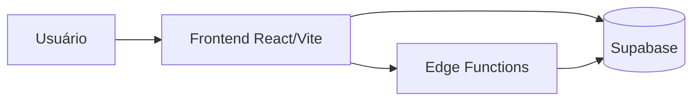
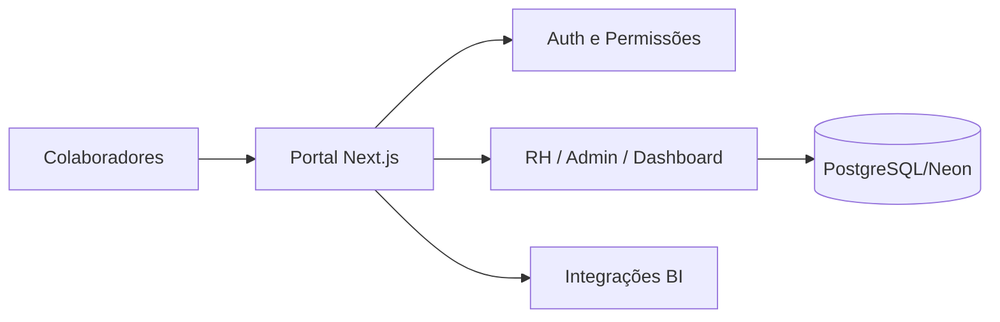
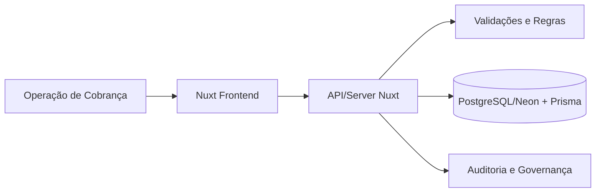
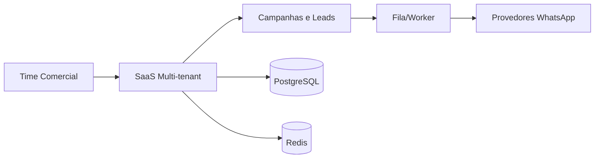
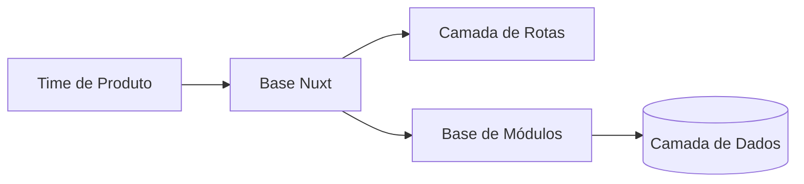
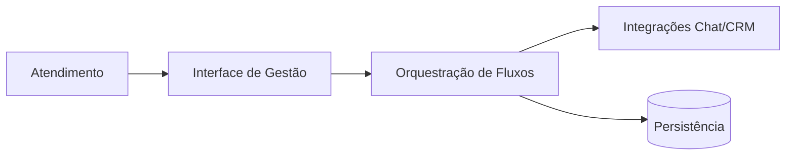
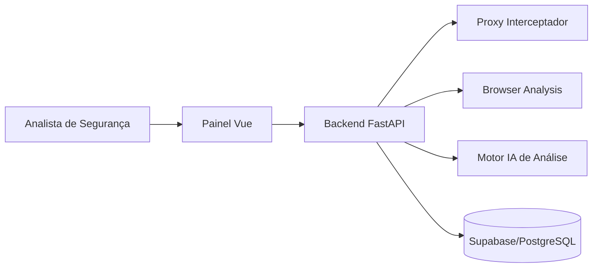

# Portfólio Técnico — Projetos Privados

Sou Desenvolvedor Sênior com atuação em arquitetura de sistemas, IA aplicada, automação de processos e governança técnica. Este repositório centraliza documentação estratégica de projetos privados, com foco em impacto de negócio, escalabilidade e qualidade de entrega.

## Perfil Profissional

- Especialista em estruturação de produtos e plataformas com visão fim a fim: arquitetura, desenvolvimento, operação e evolução contínua.
- Forte atuação em ambientes multi-repositório, padronização técnica e automação de rotinas de engenharia.
- Experiência prática em segurança, rastreabilidade, CI/CD, documentação viva e integração de IA no ciclo de desenvolvimento.

## Projetos em Destaque

### 1) wwwfigcodes
Plataforma institucional e de posicionamento digital, construída com React, TypeScript e Supabase.

**Foco:** presença digital, experiência de navegação e integração com backend serverless.

### 2) portal_s4a
Intranet corporativa robusta com módulos administrativos e operacionais (RH, permissões, gestão interna, dashboards).

**Foco:** produtividade interna, governança de acesso e centralização de processos.

### 3) gestao_cobranca_avantti
Sistema de gestão de cobrança com arquitetura orientada a segurança, padronização e rastreabilidade.

**Foco:** eficiência operacional, qualidade de dados e suporte à tomada de decisão.

### 4) WhatsUpLeads
SaaS multi-tenant para automação de campanhas via WhatsApp, com integrações externas e fluxo escalável de processamento.

**Foco:** automação comercial, escalabilidade e operação contínua em produção.

### 5) router_db_avantti
Base de aplicação para organização de rotas e estrutura de evolução de produto.

**Foco:** fundação técnica para crescimento sustentável e aceleração de novas funcionalidades.

### 6) Chatwoot_Manager
Projeto voltado à gestão e integração de operações de atendimento/conversão, com base extensível.

**Foco:** orquestração operacional e estruturação de fluxos com potencial de expansão.

### 7) DataSniffer-AI
Plataforma de análise de segurança web com IA, incluindo proxy interceptador, análise de vulnerabilidades e automações de inspeção.

**Foco:** segurança aplicada, inteligência de análise e redução de risco técnico.

## Diagramas Mermaid por Projeto

### wwwfigcodes

### portal_s4a

### gestao_cobranca_avantti

### WhatsUpLeads

### router_db_avantti

### Chatwoot_Manager

### DataSniffer-AI

## Tecnologias e Práticas

- **Frontend:** React, Next.js, Nuxt, Vue, TypeScript, Tailwind, PrimeVue, shadcn/ui
- **Backend & Dados:** FastAPI, Node.js, Supabase, PostgreSQL, Prisma, Redis
- **DevOps:** GitHub Actions, Docker, automação de deploy, versionamento avançado com Git
- **Qualidade e Segurança:** linting, padrões arquiteturais, documentação viva, práticas de segurança e governança

## Tecnologias Envolvidas por Projeto

- **wwwfigcodes:** React, Vite, TypeScript, Tailwind, shadcn/ui, Supabase
- **portal_s4a:** Next.js, TypeScript, Tailwind, PostgreSQL (Neon), autenticação e permissões
- **gestao_cobranca_avantti:** Nuxt, TypeScript, PrimeVue, Tailwind, Prisma, PostgreSQL (Neon), Sentry
- **WhatsUpLeads:** Next.js, Node.js, PostgreSQL, Redis, BullMQ, Docker, GitHub Actions
- **router_db_avantti:** Nuxt, Vue, TypeScript, Vite
- **Chatwoot_Manager:** Nuxt, Vue, TypeScript, Vite
- **DataSniffer-AI:** FastAPI (Python), Vue 3, TypeScript, Supabase/PostgreSQL, Playwright, mitmproxy

## Resultados Esperados / Entregues

- Redução de tarefas manuais por meio de automação de processos técnicos.
- Melhoria de confiabilidade com padronização de arquitetura e fluxo de entrega.
- Escalabilidade de produtos multi-tenant com controle de segurança e operação.
- Aumento de visibilidade técnica para times e stakeholders via documentação estruturada.

## Observação para Recrutadores

Os códigos-fonte completos destes projetos são privados. Este material foi organizado para apresentar, de forma objetiva, minha maturidade técnica, capacidade de execução e impacto em ambientes reais de negócio.

Se necessário, posso compartilhar uma apresentação executiva por projeto (contexto, desafio, solução técnica e resultados).