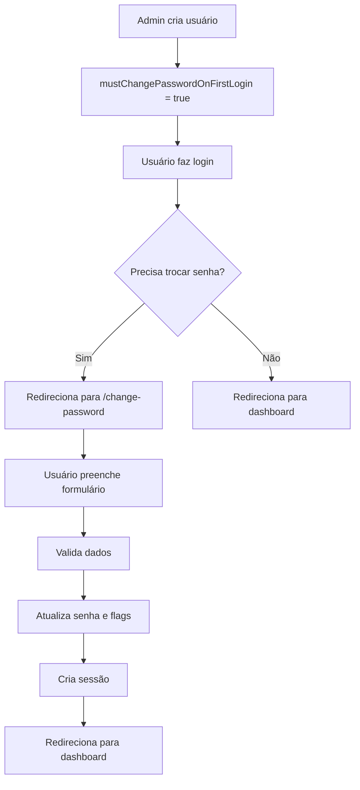

# Sistema de Troca Obrigatória de Senha

## 🎯 Objetivo

Implementar um sistema onde usuários criados por administradores sejam obrigados a trocar sua senha temporária no primeiro login, garantindo maior segurança.

## 🔧 Funcionalidades Implementadas

### 1. **Campos no Banco de Dados**
```sql
-- Novos campos na tabela users
mustChangePasswordOnFirstLogin BOOLEAN DEFAULT false
passwordChangedAt TIMESTAMP(3) NULLABLE
```

### 2. **Fluxo de Criação de Usuário**
- Admin master cria usuário com senha temporária
- Campo `mustChangePasswordOnFirstLogin` é marcado como `true`
- Usuário recebe credenciais temporárias

### 3. **Fluxo de Login**
- Usuário faz login com credenciais temporárias
- Sistema detecta `mustChangePasswordOnFirstLogin = true`
- Redireciona para `/change-password` em vez do dashboard
- Armazena `userId` no sessionStorage para segurança

### 4. **Página de Troca de Senha**
- Interface intuitiva com validações em tempo real
- Campos: senha atual, nova senha, confirmar senha
- Validações:
  - Mínimo 6 caracteres
  - Pelo menos uma letra
  - Pelo menos um número
  - Diferente da senha atual
  - Confirmação deve coincidir
- Feedback visual para cada validação

### 5. **Processo de Troca**
- Valida senha atual (temporária)
- Atualiza `passwordHash` com nova senha
- Define `mustChangePasswordOnFirstLogin = false`
- Registra `passwordChangedAt = now()`
- Cria sessão automaticamente
- Redireciona para dashboard

### 6. **Indicadores Visuais**
- Lista de usuários mostra badge "Senha Temp." para usuários que precisam trocar
- Diferenciação visual clara entre usuários ativos/inativos/senha temporária

## 📁 Arquivos Modificados/Criados

### **Banco de Dados**
- `prisma/schema.prisma` - Adicionados campos de controle
- `prisma/migrations/add_password_change_fields.sql` - Migração SQL

### **APIs**
- `app/api/auth/login/route.ts` - Detecta necessidade de troca
- `app/api/auth/change-password/route.ts` - Nova API para troca
- `app/api/admin/users/route.ts` - Marca flag na criação
- `app/api/admin/users/[id]/route.ts` - Marca flag no reset

### **Páginas**
- `app/change-password/page.tsx` - Nova página de troca obrigatória
- `app/login/page.tsx` - Atualizado para lidar com redirecionamento

### **Componentes**
- `app/admin/users/users-list.tsx` - Indicador visual
- `app/admin/users/page.tsx` - Query atualizada

### **Middleware**
- `middleware.ts` - Permite acesso à rota `/change-password`

### **Scripts**
- `scripts/migrate-password-fields.js` - Script de migração

## 🚀 Como Usar

### **1. Aplicar Migração**
```bash
# Executar migração
node scripts/migrate-password-fields.js

# Ou manualmente
pnpm prisma db push
pnpm prisma generate
```

### **2. Criar Usuário (Admin Master)**
1. Acesse `/admin/users`
2. Clique "Novo Usuário"
3. Preencha dados e defina senha temporária
4. Usuário será criado com `mustChangePasswordOnFirstLogin = true`

### **3. Primeiro Login do Usuário**
1. Usuário faz login com credenciais temporárias
2. É redirecionado automaticamente para `/change-password`
3. Deve preencher: senha atual, nova senha, confirmar
4. Após trocar, é redirecionado para dashboard

### **4. Reset de Senha (Admin)**
1. Na lista de usuários, clique no ícone de chave
2. Digite nova senha temporária
3. Usuário será marcado para trocar senha no próximo login

## 🔒 Segurança

### **Validações Implementadas**
- ✅ Senha atual deve ser válida
- ✅ Nova senha mínimo 6 caracteres
- ✅ Nova senha deve ter letra e número
- ✅ Nova senha deve ser diferente da atual
- ✅ Confirmação deve coincidir
- ✅ Empresa deve estar ativa

### **Proteções**
- ✅ Rota `/change-password` é pública mas requer userId válido
- ✅ SessionStorage usado para transferir userId com segurança
- ✅ Validação de empresa ativa
- ✅ Limpeza automática de dados temporários

## 📊 Estados do Usuário

| Estado | `mustChangePasswordOnFirstLogin` | `passwordChangedAt` | Comportamento |
|--------|----------------------------------|---------------------|---------------|
| **Novo usuário** | `true` | `null` | Deve trocar senha |
| **Senha resetada** | `true` | data anterior | Deve trocar senha |
| **Senha alterada** | `false` | data atual | Login normal |
| **Usuário existente** | `false` | `null` | Login normal |

## 🎨 Interface

### **Página de Troca de Senha**
- Design consistente com tema da aplicação
- Validações visuais em tempo real
- Indicadores de progresso
- Mensagens de erro claras
- Botões de mostrar/ocultar senha

### **Lista de Usuários**
- Badge amarelo "Senha Temp." para usuários que precisam trocar
- Tooltip explicativo
- Integração com design existente

## 🔄 Fluxo Completo



## ✅ Benefícios

- **Segurança**: Força troca de senhas temporárias
- **Usabilidade**: Fluxo intuitivo e guiado
- **Visibilidade**: Admins veem status dos usuários
- **Flexibilidade**: Funciona para criação e reset
- **Auditoria**: Registra quando senha foi alterada

## 🧪 Testes Recomendados

1. **Criar usuário novo** → Verificar redirecionamento
2. **Resetar senha existente** → Verificar flag marcada
3. **Trocar senha** → Verificar validações
4. **Login após troca** → Verificar acesso normal
5. **Indicadores visuais** → Verificar badges na lista