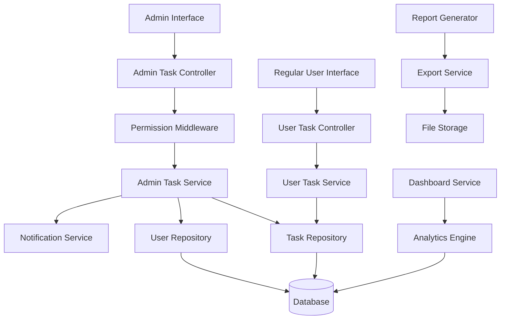
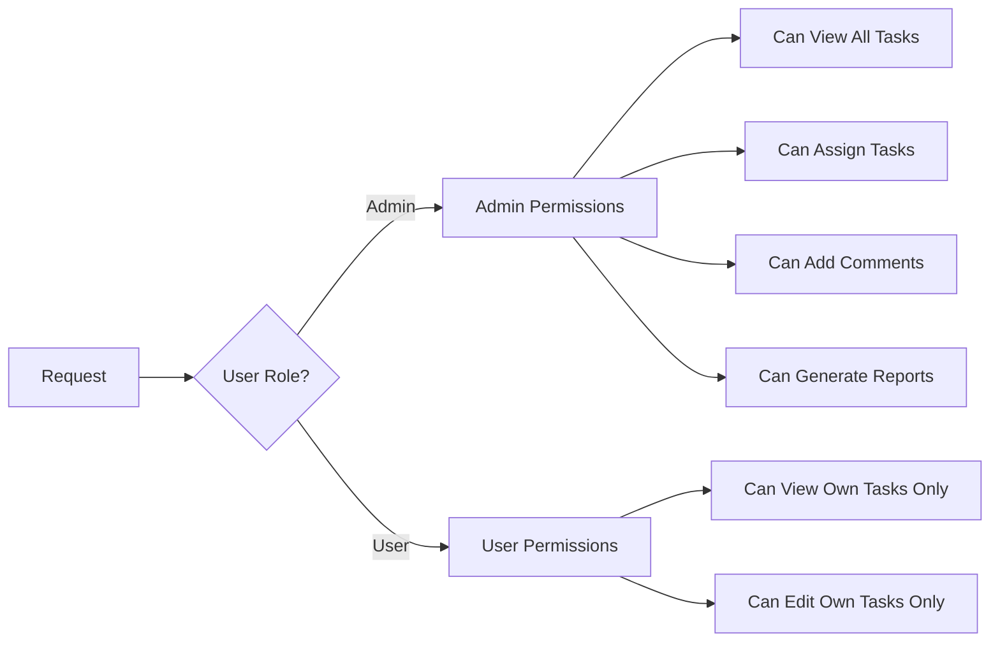

# Design Document - Gerenciamento Administrativo de Tarefas

## Overview

Este documento detalha o design técnico para implementar funcionalidades administrativas no sistema de tarefas pessoais, permitindo que administradores supervisionem, gerenciem e relatem sobre as tarefas de toda a equipe.

## Architecture

### High-Level Architecture



### Permission Layer



## Components and Interfaces

### 1. Admin Task Actions (Backend)

**File:** `src/lib/actions/admin-task.actions.ts`

```typescript
// Core admin task functions
export async function getAllTasksPaginated(
  filters?: AdminTaskFilters,
  page?: number,
  limit?: number
): Promise<PaginatedResult<AdminTaskView>>

export async function getTasksByUser(
  userId: number,
  filters?: TaskFilters
): Promise<PersonalTask[]>

export async function assignTaskToUser(
  taskData: CreateTask,
  assigneeId: number,
  assignerId: number
): Promise<TaskApiResponse>

export async function reassignTask(
  taskId: number,
  newAssigneeId: number,
  reason?: string
): Promise<TaskApiResponse>

export async function addSupervisorComment(
  taskId: number,
  comment: string,
  supervisorId: number
): Promise<CommentApiResponse>

export async function getTeamProductivityReport(
  dateRange?: DateRange,
  userIds?: number[]
): Promise<TeamProductivityReport>

export async function getUserProductivityComparison(
  userIds: number[],
  period: 'week' | 'month' | 'quarter'
): Promise<UserProductivityComparison[]>

export async function getOverdueTasksAlert(): Promise<OverdueAlert[]>

export async function bulkAssignTasks(
  taskIds: number[],
  assigneeId: number,
  assignerId: number
): Promise<BulkOperationResult>
```

### 2. Admin Task Components (Frontend)

**File:** `src/components/intranet/tasks/admin/admin-task-dashboard.tsx`

```typescript
interface AdminTaskDashboardProps {
  initialData: {
    tasks: PaginatedResult<AdminTaskView>;
    users: Employee[];
    statistics: TeamStatistics;
  };
}

export function AdminTaskDashboard({ initialData }: AdminTaskDashboardProps) {
  // Main admin dashboard with overview cards and task list
}
```

**File:** `src/components/intranet/tasks/admin/admin-task-filters.tsx`

```typescript
interface AdminTaskFiltersProps {
  users: Employee[];
  onFiltersChange: (filters: AdminTaskFilters) => void;
  initialFilters?: AdminTaskFilters;
}

export function AdminTaskFilters({ users, onFiltersChange, initialFilters }: AdminTaskFiltersProps) {
  // Advanced filtering component with user selection, date ranges, etc.
}
```

**File:** `src/components/intranet/tasks/admin/team-productivity-report.tsx`

```typescript
interface TeamProductivityReportProps {
  data: TeamProductivityReport;
  dateRange: DateRange;
  onDateRangeChange: (range: DateRange) => void;
}

export function TeamProductivityReport({ data, dateRange, onDateRangeChange }: TeamProductivityReportProps) {
  // Comprehensive productivity report with charts and metrics
}
```

### 3. Admin Task List Component

**File:** `src/components/intranet/tasks/admin/admin-task-list.tsx`

```typescript
interface AdminTaskListProps {
  tasks: PaginatedResult<AdminTaskView>;
  onTaskSelect: (task: AdminTaskView) => void;
  onBulkAction: (action: string, taskIds: number[]) => void;
}

export function AdminTaskList({ tasks, onTaskSelect, onBulkAction }: AdminTaskListProps) {
  // Enhanced task list with user information and bulk actions
}
```

### 4. Task Assignment Component

**File:** `src/components/intranet/tasks/admin/task-assignment-form.tsx`

```typescript
interface TaskAssignmentFormProps {
  users: Employee[];
  onAssign: (taskData: CreateTask, assigneeId: number) => void;
  initialData?: Partial<CreateTask>;
}

export function TaskAssignmentForm({ users, onAssign, initialData }: TaskAssignmentFormProps) {
  // Form for creating and assigning tasks to users
}
```

## Data Models

### Extended Task Models

```typescript
// Admin view of tasks with owner information
interface AdminTaskView extends PersonalTask {
  owner: {
    id: number;
    name: string;
    email: string;
    department?: string;
    photo_url?: string;
  };
  assignedBy?: {
    id: number;
    name: string;
    assignedAt: Date;
  };
  supervisorComments: SupervisorComment[];
  lastActivity: Date;
}

// Supervisor comments on tasks
interface SupervisorComment {
  id: number;
  taskId: number;
  supervisorId: number;
  supervisorName: string;
  comment: string;
  createdAt: Date;
  isPrivate: boolean; // Only visible to supervisors
}

// Task assignment tracking
interface TaskAssignment {
  id: number;
  taskId: number;
  assignerId: number;
  assigneeId: number;
  assignedAt: Date;
  reason?: string;
  status: 'active' | 'reassigned' | 'completed';
}

// Admin-specific filters
interface AdminTaskFilters extends TaskFilters {
  userIds?: number[];
  departments?: string[];
  assignedBy?: number[];
  hasComments?: boolean;
  lastActivityRange?: DateRange;
  assignmentStatus?: 'assigned' | 'self_created' | 'all';
}

// Team productivity metrics
interface TeamProductivityReport {
  period: DateRange;
  totalTasks: number;
  completedTasks: number;
  overdueTasks: number;
  averageCompletionTime: number;
  userMetrics: UserProductivityMetric[];
  departmentMetrics: DepartmentProductivityMetric[];
  trendData: ProductivityTrendData[];
  topPerformers: UserPerformanceRank[];
  alertUsers: UserAlert[];
}

interface UserProductivityMetric {
  userId: number;
  userName: string;
  department?: string;
  tasksCreated: number;
  tasksCompleted: number;
  tasksOverdue: number;
  completionRate: number;
  averageCompletionTime: number;
  productivityScore: number;
}

// Overdue alerts for administrators
interface OverdueAlert {
  userId: number;
  userName: string;
  department?: string;
  overdueCount: number;
  oldestOverdueDate: Date;
  averageOverdueDays: number;
  urgentOverdueCount: number;
}

// Bulk operation results
interface BulkOperationResult {
  success: boolean;
  totalItems: number;
  successCount: number;
  failureCount: number;
  errors: BulkOperationError[];
  message: string;
}

interface BulkOperationError {
  itemId: number;
  error: string;
}
```

### Database Schema Extensions

```sql
-- Supervisor comments table
CREATE TABLE task_supervisor_comments (
  id SERIAL PRIMARY KEY,
  task_id INTEGER NOT NULL REFERENCES personal_tasks(id) ON DELETE CASCADE,
  supervisor_id INTEGER NOT NULL REFERENCES users(id) ON DELETE CASCADE,
  comment TEXT NOT NULL,
  is_private BOOLEAN DEFAULT false,
  created_at TIMESTAMPTZ DEFAULT NOW(),
  updated_at TIMESTAMPTZ DEFAULT NOW()
);

-- Task assignments tracking
CREATE TABLE task_assignments (
  id SERIAL PRIMARY KEY,
  task_id INTEGER NOT NULL REFERENCES personal_tasks(id) ON DELETE CASCADE,
  assigner_id INTEGER NOT NULL REFERENCES users(id) ON DELETE CASCADE,
  assignee_id INTEGER NOT NULL REFERENCES users(id) ON DELETE CASCADE,
  assigned_at TIMESTAMPTZ DEFAULT NOW(),
  reason TEXT,
  status TEXT DEFAULT 'active' CHECK (status IN ('active', 'reassigned', 'completed')),
  created_at TIMESTAMPTZ DEFAULT NOW()
);

-- Admin activity log
CREATE TABLE admin_task_activities (
  id SERIAL PRIMARY KEY,
  admin_id INTEGER NOT NULL REFERENCES users(id) ON DELETE CASCADE,
  task_id INTEGER NOT NULL REFERENCES personal_tasks(id) ON DELETE CASCADE,
  action TEXT NOT NULL, -- 'view', 'comment', 'assign', 'reassign', 'edit'
  details JSONB,
  created_at TIMESTAMPTZ DEFAULT NOW()
);

-- Indexes for performance
CREATE INDEX idx_task_supervisor_comments_task_id ON task_supervisor_comments(task_id);
CREATE INDEX idx_task_assignments_assignee_id ON task_assignments(assignee_id);
CREATE INDEX idx_task_assignments_assigner_id ON task_assignments(assigner_id);
CREATE INDEX idx_admin_task_activities_admin_id ON admin_task_activities(admin_id);
CREATE INDEX idx_admin_task_activities_task_id ON admin_task_activities(task_id);
CREATE INDEX idx_admin_task_activities_created_at ON admin_task_activities(created_at);

-- Add assigned_by column to personal_tasks for tracking
ALTER TABLE personal_tasks ADD COLUMN assigned_by INTEGER REFERENCES users(id);
ALTER TABLE personal_tasks ADD COLUMN assigned_at TIMESTAMPTZ;
```

## Correctness Properties

*A property is a characteristic or behavior that should hold true across all valid executions of a system-essentially, a formal statement about what the system should do. Properties serve as the bridge between human-readable specifications and machine-verifiable correctness guarantees.*

### Property 1: Admin Universal Task Access
*For any* administrator and any task in the system, the administrator should be able to view the task with complete owner information, regardless of who created the task.
**Validates: Requirements 1.1, 1.2, 1.5**

### Property 2: Filter Result Precision
*For any* combination of admin filters (user, department, status, priority, date range, search text), the returned results should contain only tasks that match all specified criteria, with no false positives or omissions.
**Validates: Requirements 2.1, 2.2, 2.3, 2.4, 2.5**

### Property 3: Productivity Metrics Accuracy
*For any* user and time period, the calculated productivity metrics (completion rate, average completion time, task distribution) should accurately reflect the user's actual task data with no calculation errors.
**Validates: Requirements 3.1, 3.2, 3.5, 6.1, 6.2**

### Property 4: Task Assignment Completeness
*For any* task assignment or reassignment operation, the system should create the assignment, track all metadata (assigner, assignee, timestamp), and allow bulk operations while maintaining data integrity.
**Validates: Requirements 4.1, 4.3, 4.4, 4.5**

### Property 5: Administrative Notification Consistency
*For any* administrative action that affects a user (task assignment, supervisor comment, task modification, overdue alerts), the system should send notifications to all appropriate parties without duplicates or omissions.
**Validates: Requirements 4.2, 5.3, 7.4, 8.1, 8.3, 8.4, 8.5**

### Property 6: Supervisor Comment Management
*For any* supervisor comment added to a task, the comment should be stored with complete metadata (author, timestamp), be visible to the task owner and administrators, and maintain proper audit trails.
**Validates: Requirements 5.1, 5.4, 5.5**

### Property 7: Permission Boundary Enforcement
*For any* user attempting to access admin functionality, the system should verify admin role status, grant appropriate access levels, and require confirmation for sensitive operations on other users' tasks.
**Validates: Requirements 7.1, 7.2, 10.2, 10.4**

### Property 8: Administrative Audit Trail Integrity
*For any* administrative action performed on tasks (view, edit, assign, comment), the system should log the action with complete details (admin ID, task ID, action type, timestamp) ensuring no actions go unrecorded.
**Validates: Requirements 7.3**

### Property 9: Export Data Completeness
*For any* export operation with applied filters, the generated files (Excel, PDF, CSV) should contain all tasks matching the filters with complete data and proper formatting, maintaining filter consistency across formats.
**Validates: Requirements 9.1, 9.2, 9.3, 9.5**

### Property 10: Dashboard Drill-down Consistency
*For any* metric displayed on the executive dashboard, clicking to drill down should show a task list that exactly matches the criteria used to calculate that metric, with no discrepancies between summary and detail views.
**Validates: Requirements 6.5**

## Error Handling

### Admin Permission Errors
- **Insufficient Privileges**: Clear error messages when non-admins attempt admin actions
- **Task Access Denied**: Graceful handling when admin permissions are revoked mid-session
- **Bulk Operation Failures**: Detailed error reporting for failed bulk operations

### Data Consistency Errors
- **Assignment Conflicts**: Handle cases where tasks are reassigned while being edited
- **Concurrent Modifications**: Prevent data corruption from simultaneous admin actions
- **Orphaned References**: Clean up references when users or tasks are deleted

### Performance and Scalability
- **Large Dataset Handling**: Efficient pagination and filtering for organizations with many tasks
- **Report Generation Timeouts**: Async processing for large reports with progress indicators
- **Real-time Updates**: Efficient WebSocket or polling for dashboard updates

## Testing Strategy

### Unit Tests
- Test admin permission checks for all administrative functions
- Verify task assignment and reassignment logic
- Test filter combinations and edge cases
- Validate productivity calculation algorithms
- Test bulk operation error handling

### Property-Based Tests
- Generate random task datasets and verify filter accuracy
- Test permission boundaries with various user role combinations
- Validate notification delivery for all administrative actions
- Test export completeness with random filter combinations
- Verify productivity metrics accuracy across different time periods

### Integration Tests
- Test complete admin workflows from UI to database
- Verify notification system integration
- Test report generation and export functionality
- Validate real-time dashboard updates
- Test concurrent admin operations

### Performance Tests
- Load test admin dashboard with large datasets
- Test bulk operations with hundreds of tasks
- Verify report generation performance
- Test concurrent admin user scenarios

## Implementation Notes

### Phase 1: Core Admin Functionality
1. Implement basic admin task viewing and filtering
2. Add task assignment capabilities
3. Create admin-specific UI components
4. Implement permission middleware

### Phase 2: Advanced Features
1. Add supervisor comments and notifications
2. Implement team productivity reports
3. Create dashboard with real-time metrics
4. Add bulk operations

### Phase 3: Analytics and Reporting
1. Implement advanced analytics
2. Add export functionality
3. Create automated alert system
4. Add scheduling for reports

### Security Considerations
- All admin actions must be logged for audit purposes
- Sensitive task information should be handled with appropriate privacy controls
- Admin sessions should have shorter timeouts for security
- Bulk operations should require additional confirmation steps

### Performance Optimizations
- Use database indexes for efficient admin queries
- Implement caching for frequently accessed admin data
- Use pagination for all admin list views
- Optimize report generation with background processing