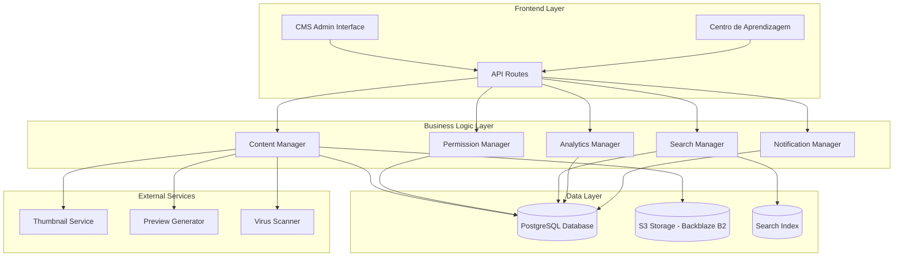
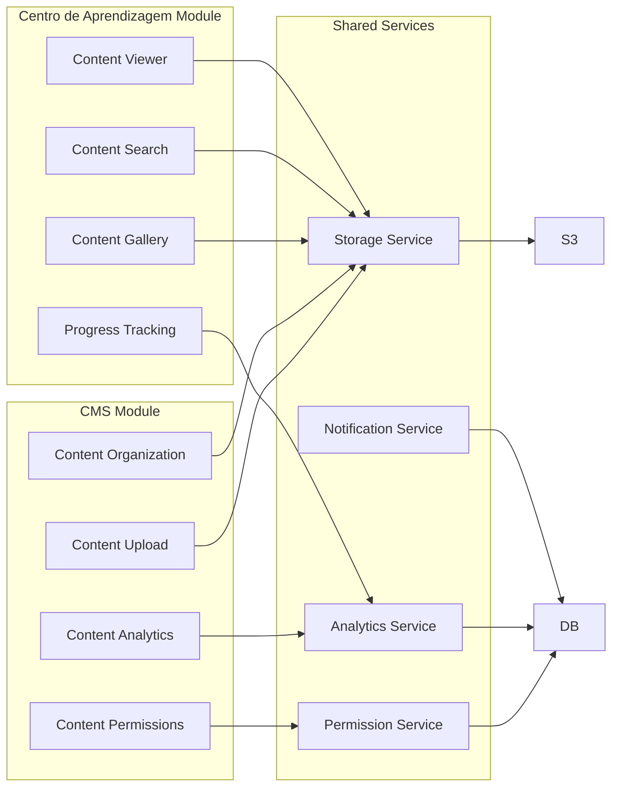

# Design Document - Sistema de Gestão de Conteúdo e Centro de Aprendizagem

## Overview

O Sistema de Gestão de Conteúdo e Centro de Aprendizagem é uma solução moderna e integrada que transforma a forma como organizações gerenciam e consomem conteúdo educacional. O sistema é composto por dois módulos principais:

1. **CMS (Content Management System)**: Interface administrativa para gerenciamento de conteúdos
2. **Centro de Aprendizagem**: Portal moderno para consumo de conteúdos pelos usuários finais

A solução utiliza armazenamento S3 para escalabilidade, interfaces modernas para melhor experiência do usuário, e analytics avançados para otimização contínua do conteúdo.

## Architecture

### High-Level Architecture



### Module Architecture



## Components and Interfaces

### Core Components

#### 1. Content Management System (CMS)

**Location**: `/configuracoes/gestao-de-conteudo`

**Components**:
- `ContentUploadForm`: Interface para upload de arquivos
- `ContentEditor`: Editor de metadados e configurações
- `CategoryManager`: Gerenciamento de categorias hierárquicas
- `PermissionManager`: Controle de acesso e permissões
- `ContentAnalytics`: Dashboard de métricas e relatórios

**Key Features**:
- Upload drag-and-drop com preview
- Validação de tipos de arquivo e tamanho
- Processamento automático de thumbnails
- Sistema de tags inteligente
- Controle granular de permissões

#### 2. Centro de Aprendizagem

**Location**: `/centro-de-aprendizagem`

**Components**:
- `ContentGallery`: Interface de galeria com cards visuais
- `SearchInterface`: Busca avançada com filtros
- `ContentViewer`: Visualizadores para diferentes tipos de arquivo
- `ProgressDashboard`: Acompanhamento pessoal de progresso
- `RecommendationEngine`: Sistema de recomendações

**Key Features**:
- Interface responsiva tipo Pinterest/galeria
- Busca em tempo real com sugestões
- Visualizadores integrados (PDF, imagens, vídeos)
- Sistema de favoritos e histórico
- Trilhas de aprendizagem personalizadas

#### 3. Storage Service

**Components**:
- `S3Manager`: Gerenciamento de uploads e downloads
- `URLGenerator`: Geração de URLs assinadas
- `FileProcessor`: Processamento de arquivos (thumbnails, metadata)
- `BackupManager`: Sistema de backup e recuperação

#### 4. Search Service

**Components**:
- `SearchIndexer`: Indexação de conteúdo
- `QueryProcessor`: Processamento de consultas
- `FilterManager`: Sistema de filtros avançados
- `SuggestionEngine`: Sugestões automáticas

## Data Models

### Content Model

```typescript
interface Content {
  id: number;
  title: string;
  description: string;
  file_name: string;
  file_type: string;
  file_size: number;
  file_url: string;
  thumbnail_url?: string;
  category_id: number;
  tags: string[];
  permissions: ContentPermission[];
  metadata: ContentMetadata;
  status: 'draft' | 'published' | 'archived';
  created_by: number;
  created_at: Date;
  updated_at: Date;
  published_at?: Date;
}

interface ContentMetadata {
  duration?: number; // para vídeos
  pages?: number; // para documentos
  dimensions?: { width: number; height: number }; // para imagens
  extracted_text?: string; // para busca
  language?: string;
  author?: string;
}

interface ContentPermission {
  id: number;
  content_id: number;
  permission_type: 'user' | 'department' | 'role';
  permission_value: string;
  access_level: 'view' | 'download' | 'admin';
}
```

### Category Model

```typescript
interface Category {
  id: number;
  name: string;
  description?: string;
  icon?: string;
  parent_id?: number;
  order_index: number;
  is_active: boolean;
  created_at: Date;
  updated_at: Date;
  
  // Computed fields
  children?: Category[];
  content_count?: number;
  full_path?: string;
}
```

### User Progress Model

```typescript
interface UserProgress {
  id: number;
  user_id: number;
  content_id: number;
  status: 'not_started' | 'in_progress' | 'completed';
  progress_percentage: number;
  time_spent: number; // em segundos
  last_accessed: Date;
  completed_at?: Date;
  notes?: string;
}

interface UserActivity {
  id: number;
  user_id: number;
  content_id: number;
  action: 'view' | 'download' | 'favorite' | 'share';
  timestamp: Date;
  metadata?: any;
}
```

### Analytics Model

```typescript
interface ContentAnalytics {
  content_id: number;
  total_views: number;
  total_downloads: number;
  unique_viewers: number;
  average_time_spent: number;
  completion_rate: number;
  rating_average?: number;
  rating_count?: number;
  last_updated: Date;
}

interface SystemAnalytics {
  date: Date;
  total_content: number;
  total_users: number;
  total_views: number;
  total_downloads: number;
  storage_used: number;
  most_popular_content: number[];
  trending_categories: number[];
}
```

## Correctness Properties

*A property is a characteristic or behavior that should hold true across all valid executions of a system-essentially, a formal statement about what the system should do. Properties serve as the bridge between human-readable specifications and machine-verifiable correctness guarantees.*

### Property Reflection

After analyzing all acceptance criteria, I identified several areas where properties can be consolidated:

- **File Upload Properties**: Multiple criteria about upload validation, processing, and storage can be combined into comprehensive upload properties
- **Permission Properties**: Various permission-related criteria can be unified into access control properties
- **Search Properties**: Different search and filtering criteria can be combined into search functionality properties
- **Content Management Properties**: Category management, content organization, and metadata handling can be consolidated

### Core Properties

**Property 1: File Upload Round Trip**
*For any* valid file upload, storing the file in S3 and creating database record should allow retrieval of the same file with correct metadata
**Validates: Requirements 1.2, 2.3, 10.1**

**Property 2: Content Visibility Consistency**
*For any* published content, if a user has permission to view it, the content should appear in their Centro de Aprendizagem interface
**Validates: Requirements 1.5, 7.2**

**Property 3: File Type Validation**
*For any* file upload attempt, the system should accept only supported formats (PDF, DOC, DOCX, XLS, XLSX, PPT, PPTX, JPG, PNG, GIF, MP4, ZIP) and reject all others
**Validates: Requirements 2.1, 2.2**

**Property 4: Category Hierarchy Integrity**
*For any* category operations (create, move, delete), the hierarchical structure should remain consistent without circular references or orphaned categories
**Validates: Requirements 3.1, 3.2, 3.3, 3.4**

**Property 5: Search Result Accuracy**
*For any* search query, all returned results should contain the search terms in title, description, tags, or indexed content
**Validates: Requirements 4.4, 6.1, 6.2**

**Property 6: Permission Enforcement**
*For any* content access attempt, users should only be able to view/download content they have explicit permission for
**Validates: Requirements 7.1, 7.2, 7.3**

**Property 7: Progress Tracking Consistency**
*For any* content access, the system should accurately record view time, completion status, and update user progress statistics
**Validates: Requirements 8.1, 8.2, 8.3**

**Property 8: S3 Storage Consistency**
*For any* file operation (upload, access, delete), the S3 storage state should remain consistent with database records
**Validates: Requirements 10.1, 10.2, 10.3, 10.5**

**Property 9: Thumbnail Generation**
*For any* supported image or PDF file, the system should generate appropriate thumbnails for gallery display
**Validates: Requirements 2.4, 4.2**

**Property 10: URL Security**
*For any* file access, generated URLs should be temporary, signed, and expire within the configured timeframe
**Validates: Requirements 10.2**

## Error Handling

### File Upload Errors

```typescript
enum UploadError {
  FILE_TOO_LARGE = 'FILE_TOO_LARGE',
  INVALID_FILE_TYPE = 'INVALID_FILE_TYPE',
  VIRUS_DETECTED = 'VIRUS_DETECTED',
  S3_UPLOAD_FAILED = 'S3_UPLOAD_FAILED',
  METADATA_EXTRACTION_FAILED = 'METADATA_EXTRACTION_FAILED',
  THUMBNAIL_GENERATION_FAILED = 'THUMBNAIL_GENERATION_FAILED'
}

interface UploadResult {
  success: boolean;
  content?: Content;
  error?: UploadError;
  message?: string;
  retryable?: boolean;
}
```

### Permission Errors

```typescript
enum PermissionError {
  ACCESS_DENIED = 'ACCESS_DENIED',
  INSUFFICIENT_PERMISSIONS = 'INSUFFICIENT_PERMISSIONS',
  CONTENT_NOT_FOUND = 'CONTENT_NOT_FOUND',
  PERMISSION_EXPIRED = 'PERMISSION_EXPIRED'
}

interface AccessResult {
  allowed: boolean;
  error?: PermissionError;
  message?: string;
  suggested_action?: string;
}
```

### Search Errors

```typescript
enum SearchError {
  QUERY_TOO_SHORT = 'QUERY_TOO_SHORT',
  INVALID_FILTERS = 'INVALID_FILTERS',
  SEARCH_INDEX_UNAVAILABLE = 'SEARCH_INDEX_UNAVAILABLE',
  TIMEOUT = 'TIMEOUT'
}

interface SearchResult {
  success: boolean;
  results?: Content[];
  total_count?: number;
  error?: SearchError;
  suggestions?: string[];
}
```

## Testing Strategy

### Unit Testing Approach

**Focus Areas:**
- File upload validation and processing
- Permission checking logic
- Search query processing
- Category hierarchy operations
- URL generation and signing
- Metadata extraction

**Key Test Cases:**
- Valid file uploads with different formats
- Invalid file rejection scenarios
- Permission matrix testing
- Search accuracy with various queries
- Category operations maintaining hierarchy
- S3 integration error scenarios

### Property-Based Testing Approach

**Testing Framework:** fast-check (JavaScript/TypeScript property testing library)

**Property Test Configuration:**
- Minimum 100 iterations per property test
- Custom generators for file types, user permissions, and content structures
- Shrinking enabled for minimal failing examples

**Property Test Implementation:**

Each property-based test will be tagged with the format: **Feature: content-management-system, Property {number}: {property_text}**

**Property 1 Test**: Generate random valid files, upload them, and verify round-trip consistency
**Property 2 Test**: Generate random content and user combinations, verify visibility rules
**Property 3 Test**: Generate random file types, verify acceptance/rejection patterns
**Property 4 Test**: Generate random category operations, verify hierarchy integrity
**Property 5 Test**: Generate random search queries, verify result accuracy
**Property 6 Test**: Generate random user/content combinations, verify permission enforcement
**Property 7 Test**: Generate random content access patterns, verify progress tracking
**Property 8 Test**: Generate random file operations, verify S3/database consistency
**Property 9 Test**: Generate random image/PDF files, verify thumbnail generation
**Property 10 Test**: Generate random file access requests, verify URL security

### Integration Testing

**Test Scenarios:**
- Complete content lifecycle (upload → categorize → publish → access)
- User journey through Centro de Aprendizagem
- Permission changes and immediate effect
- Search functionality across different content types
- Analytics data collection and reporting
- S3 integration with fallback scenarios

### Performance Testing

**Metrics to Monitor:**
- File upload speed for different sizes
- Search response time with large content libraries
- Gallery loading time with many items
- Thumbnail generation time
- Database query performance
- S3 operation latency

**Load Testing Scenarios:**
- Concurrent file uploads
- Multiple users searching simultaneously
- Heavy gallery browsing
- Bulk permission updates
- Analytics report generation

### Security Testing

**Security Validations:**
- File type validation bypass attempts
- Permission escalation attempts
- S3 URL manipulation attempts
- SQL injection in search queries
- XSS in content metadata
- CSRF in admin operations

**Penetration Testing Focus:**
- File upload security
- Access control mechanisms
- URL signing validation
- Session management
- Input sanitization
- Error message information leakage