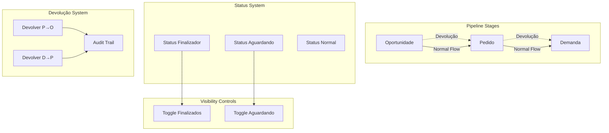

# Design Document - CRM Bidirectional Flow

## Overview

This design document outlines the implementation of bidirectional flow functionality in the CRM system, enabling items to move backward through the sales pipeline (Demanda → Pedido → Oportunidade) while maintaining data integrity, audit trails, and proper visibility controls.

The solution leverages the existing `is_finalizer` field in the `crm_statuses` table and introduces new concepts of "waiting" states and visibility toggles to provide a comprehensive backward flow system.

## Architecture

### High-Level Architecture



### Database Schema Extensions

#### New Status Types
```sql
-- Add new status type for waiting state
ALTER TABLE crm_statuses ADD COLUMN IF NOT EXISTS is_waiting_status BOOLEAN DEFAULT FALSE;

-- Create devolução audit table
CREATE TABLE IF NOT EXISTS crm_devolucao_audit (
    id SERIAL PRIMARY KEY,
    source_type TEXT NOT NULL CHECK (source_type IN ('opportunity', 'order', 'post_sales')),
    source_id INTEGER NOT NULL,
    target_type TEXT NOT NULL CHECK (target_type IN ('opportunity', 'order', 'post_sales')),
    target_id INTEGER NOT NULL,
    user_id INTEGER NOT NULL REFERENCES users(id),
    reason TEXT NOT NULL,
    created_at TIMESTAMPTZ DEFAULT NOW(),
    metadata JSONB DEFAULT '{}'::jsonb
);

-- Add relationship tracking to existing tables
ALTER TABLE crm_opportunities ADD COLUMN IF NOT EXISTS source_devolucao_id INTEGER;
ALTER TABLE crm_opportunities ADD COLUMN IF NOT EXISTS source_devolucao_type TEXT;

ALTER TABLE crm_orders ADD COLUMN IF NOT EXISTS source_devolucao_id INTEGER;
ALTER TABLE crm_orders ADD COLUMN IF NOT EXISTS source_devolucao_type TEXT;

ALTER TABLE crm_post_sales ADD COLUMN IF NOT EXISTS source_devolucao_id INTEGER;
ALTER TABLE crm_post_sales ADD COLUMN IF NOT EXISTS source_devolucao_type TEXT;
```

## Components and Interfaces

### 1. Visibility Toggle Component

```typescript
interface VisibilityTogglesProps {
  showFinalized: boolean;
  showWaiting: boolean;
  onToggleFinalized: (show: boolean) => void;
  onToggleWaiting: (show: boolean) => void;
}

export function VisibilityToggles({
  showFinalized,
  showWaiting,
  onToggleFinalized,
  onToggleWaiting
}: VisibilityTogglesProps) {
  return (
    <div className="flex gap-4 items-center">
      <div className="flex items-center space-x-2">
        <Switch
          id="show-finalized"
          checked={showFinalized}
          onCheckedChange={onToggleFinalized}
        />
        <Label htmlFor="show-finalized">Mostrar Finalizados</Label>
      </div>
      <div className="flex items-center space-x-2">
        <Switch
          id="show-waiting"
          checked={showWaiting}
          onCheckedChange={onToggleWaiting}
        />
        <Label htmlFor="show-waiting">Mostrar Aguardando</Label>
      </div>
    </div>
  );
}
```

### 2. Devolução Button Component

```typescript
interface DevolucaoButtonProps {
  sourceType: 'order' | 'post_sales';
  sourceId: number;
  targetType: 'opportunity' | 'order';
  onSuccess?: () => void;
  permissions: string[];
}

export function DevolucaoButton({
  sourceType,
  sourceId,
  targetType,
  onSuccess,
  permissions
}: DevolucaoButtonProps) {
  const [isOpen, setIsOpen] = useState(false);
  const [reason, setReason] = useState('');
  const [loading, setLoading] = useState(false);

  const canPerformDevolucao = permissions.includes(`crm:devolucao:${sourceType}_to_${targetType}`);

  if (!canPerformDevolucao) return null;

  const handleDevolucao = async () => {
    setLoading(true);
    try {
      const result = await performDevolucao({
        sourceType,
        sourceId,
        targetType,
        reason
      });
      
      if (result.success) {
        toast.success('Devolução realizada com sucesso');
        setIsOpen(false);
        onSuccess?.();
      } else {
        toast.error(result.error);
      }
    } catch (error) {
      toast.error('Erro ao realizar devolução');
    } finally {
      setLoading(false);
    }
  };

  return (
    <>
      <Button
        variant="outline"
        onClick={() => setIsOpen(true)}
        className="text-orange-600 border-orange-600 hover:bg-orange-50"
      >
        <ArrowLeft className="w-4 h-4 mr-2" />
        Devolver para {targetType === 'opportunity' ? 'Oportunidade' : 'Pedido'}
      </Button>

      <Dialog open={isOpen} onOpenChange={setIsOpen}>
        <DialogContent>
          <DialogHeader>
            <DialogTitle>Confirmar Devolução</DialogTitle>
            <DialogDescription>
              Esta ação irá criar um novo registro na esteira anterior e marcar o atual como aguardando.
            </DialogDescription>
          </DialogHeader>
          
          <div className="space-y-4">
            <div>
              <Label htmlFor="reason">Motivo da devolução *</Label>
              <Textarea
                id="reason"
                value={reason}
                onChange={(e) => setReason(e.target.value)}
                placeholder="Descreva o motivo da devolução..."
                required
              />
            </div>
          </div>

          <DialogFooter>
            <Button variant="outline" onClick={() => setIsOpen(false)}>
              Cancelar
            </Button>
            <Button 
              onClick={handleDevolucao} 
              disabled={!reason.trim() || loading}
            >
              {loading ? 'Processando...' : 'Confirmar Devolução'}
            </Button>
          </DialogFooter>
        </DialogContent>
      </Dialog>
    </>
  );
}
```

### 3. Enhanced Pipeline Query Service

```typescript
interface PipelineQueryOptions {
  showFinalized?: boolean;
  showWaiting?: boolean;
  userId?: number;
  departmentId?: number;
}

export class PipelineQueryService {
  static async getOpportunities(options: PipelineQueryOptions = {}) {
    const { showFinalized = false, showWaiting = false } = options;
    
    let whereConditions = [];
    
    if (!showFinalized) {
      whereConditions.push(`s.is_finalizer = false`);
    }
    
    if (!showWaiting) {
      whereConditions.push(`s.is_waiting_status = false`);
    }
    
    const whereClause = whereConditions.length > 0 
      ? `WHERE ${whereConditions.join(' AND ')}`
      : '';

    return await db`
      SELECT 
        o.*,
        c.company_name as client_name,
        s.name as status_name,
        s.color as status_color,
        s.is_finalizer,
        s.is_waiting_status,
        CASE 
          WHEN o.source_devolucao_id IS NOT NULL THEN true
          ELSE false
        END as is_from_devolucao
      FROM crm_opportunities o
      JOIN client_portfolio c ON o.client_id = c.id
      JOIN crm_statuses s ON o.status_id = s.id
      ${whereClause}
      ORDER BY o.updated_at DESC
    `;
  }

  static async getOrders(options: PipelineQueryOptions = {}) {
    // Similar implementation for orders
  }

  static async getPostSales(options: PipelineQueryOptions = {}) {
    // Similar implementation for post-sales
  }
}
```

## Data Models

### Devolução Audit Model

```typescript
export interface DevolucaoAudit {
  id: number;
  source_type: 'opportunity' | 'order' | 'post_sales';
  source_id: number;
  target_type: 'opportunity' | 'order' | 'post_sales';
  target_id: number;
  user_id: number;
  reason: string;
  created_at: Date;
  metadata: Record<string, any>;
}
```

### Enhanced CRM Status Model

```typescript
export interface CrmStatus {
  id: number;
  name: string;
  color: string;
  type: 'opportunity' | 'order' | 'post_sales';
  order_index: number;
  is_finalizer: boolean;
  is_waiting_status: boolean; // New field
  create_order_on_entry: boolean;
  target_order_status_id?: number;
  create_demand_on_entry: boolean;
  target_demand_status_id?: number;
  visible_to_users: string[];
  is_visible_to_all: boolean;
}
```

### Pipeline Item with Devolução Info

```typescript
export interface PipelineItem {
  id: number;
  // ... existing fields
  is_from_devolucao: boolean;
  source_devolucao_id?: number;
  source_devolucao_type?: string;
  devolucao_history: DevolucaoAudit[];
  related_items: {
    opportunities: number[];
    orders: number[];
    post_sales: number[];
  };
}
```

## Correctness Properties

*A property is a characteristic or behavior that should hold true across all valid executions of a system-essentially, a formal statement about what the system should do. Properties serve as the bridge between human-readable specifications and machine-verifiable correctness guarantees.*

### Property Reflection

After reviewing all properties identified in the prework, I've identified several areas where properties can be consolidated:

**Redundancy Analysis:**
- Properties 3.3, 4.3, and 8.1 all test data copying during devolução - these can be combined into one comprehensive property
- Properties 3.4 and 4.4 both test status changes to "Aguardando" - these can be combined
- Properties 3.5 and 4.5 both test audit trail creation - these can be combined
- Properties 6.1 and 6.2 both test relationship display - these can be combined into one bidirectional property
- Properties 7.2 and 7.3 both test permission enforcement - these can be combined

**Property 1: Finalizer Status Filtering**
*For any* pipeline query, when showFinalized is false, all returned items should have statuses where is_finalizer = false
**Validates: Requirements 1.1, 1.2, 1.5**

**Property 2: Visibility Toggle Behavior**
*For any* pipeline view, when visibility toggles are changed, the displayed items should match the toggle states (finalized items shown only when showFinalized is true, waiting items shown only when showWaiting is true)
**Validates: Requirements 2.2, 2.3, 2.4**

**Property 3: Session Persistence**
*For any* user session, when visibility toggle states are changed, they should persist throughout the session until explicitly changed again
**Validates: Requirements 2.5**

**Property 4: Devolução Data Integrity**
*For any* valid devolução operation, all relevant data from the source item should be correctly copied to the new target item, preserving custom fields and attachments where applicable
**Validates: Requirements 3.3, 4.3, 8.1, 8.3, 8.4**

**Property 5: Status Change on Devolução**
*For any* completed devolução operation, the original item's status should be changed to a waiting status (is_waiting_status = true)
**Validates: Requirements 3.4, 4.4**

**Property 6: Audit Trail Creation**
*For any* devolução operation, a complete audit trail should be created linking the source and target items with timestamp, user, and reason
**Validates: Requirements 3.5, 4.5, 5.1, 5.3**

**Property 7: Permission Enforcement**
*For any* user attempting devolução operations, the system should only allow the operation if the user has the appropriate permissions, and UI elements should only be visible to authorized users
**Validates: Requirements 7.1, 7.2, 7.3**

**Property 8: Bidirectional Relationship Display**
*For any* item involved in devolução, both the source and target items should display references to each other with working navigation links
**Validates: Requirements 6.1, 6.2, 6.3**

**Property 9: Transaction Rollback on Failure**
*For any* devolução operation, if data validation fails at any point, the entire operation should be rolled back leaving the system in its original state
**Validates: Requirements 8.2, 8.5**

**Property 10: Complete Relationship Tree Display**
*For any* item that is part of a devolução chain, the system should display the complete relationship tree showing all connected items
**Validates: Requirements 6.4, 5.2**

## Error Handling

### Devolução Operation Errors

```typescript
export enum DevolucaoErrorType {
  PERMISSION_DENIED = 'PERMISSION_DENIED',
  INVALID_SOURCE = 'INVALID_SOURCE',
  INVALID_TARGET_TYPE = 'INVALID_TARGET_TYPE',
  DATA_VALIDATION_FAILED = 'DATA_VALIDATION_FAILED',
  TRANSACTION_FAILED = 'TRANSACTION_FAILED',
  MISSING_REQUIRED_FIELDS = 'MISSING_REQUIRED_FIELDS'
}

export class DevolucaoError extends Error {
  constructor(
    public type: DevolucaoErrorType,
    message: string,
    public details?: any
  ) {
    super(message);
    this.name = 'DevolucaoError';
  }
}
```

### Error Recovery Strategies

1. **Transaction Rollback**: All devolução operations are wrapped in database transactions
2. **Validation Checkpoints**: Multiple validation points prevent invalid operations
3. **User Feedback**: Clear error messages guide users to resolve issues
4. **Audit Logging**: All errors are logged for debugging and monitoring

## Testing Strategy

### Unit Testing Approach

**Focus Areas:**
- Devolução service functions
- Permission validation logic
- Data transformation utilities
- Query filtering logic

**Example Unit Tests:**
```typescript
describe('DevolucaoService', () => {
  test('should copy all relevant data during order to opportunity devolução', () => {
    // Test data copying logic
  });

  test('should validate permissions before allowing devolução', () => {
    // Test permission validation
  });

  test('should create proper audit trail', () => {
    // Test audit trail creation
  });
});
```

### Property-Based Testing Approach

**Testing Framework:** We will use **fast-check** for JavaScript/TypeScript property-based testing, configured to run a minimum of 100 iterations per property test.

**Property Test Implementation:**
Each correctness property will be implemented as a single property-based test, tagged with comments referencing the design document property number.

**Example Property Tests:**
```typescript
import fc from 'fast-check';

describe('CRM Bidirectional Flow Properties', () => {
  test('Property 1: Finalizer Status Filtering', () => {
    /**Feature: crm-bidirectional-flow, Property 1: Finalizer Status Filtering**/
    fc.assert(fc.property(
      fc.array(generatePipelineItem()),
      fc.boolean(),
      (items, showFinalized) => {
        const result = filterPipelineItems(items, { showFinalized });
        if (!showFinalized) {
          return result.every(item => !item.status.is_finalizer);
        }
        return true;
      }
    ), { numRuns: 100 });
  });

  test('Property 4: Devolução Data Integrity', () => {
    /**Feature: crm-bidirectional-flow, Property 4: Devolução Data Integrity**/
    fc.assert(fc.property(
      generateValidOrder(),
      (sourceOrder) => {
        const targetOpportunity = performDevolucao(sourceOrder, 'opportunity');
        return validateDataIntegrity(sourceOrder, targetOpportunity);
      }
    ), { numRuns: 100 });
  });
});
```

### Integration Testing

**Test Scenarios:**
- Complete devolução workflows (Demanda → Pedido → Oportunidade)
- Permission-based access control
- UI toggle functionality
- Audit trail generation and display

### Manual Testing Checklist

- [ ] Visibility toggles work correctly in all pipeline views
- [ ] Devolução buttons appear only for authorized users
- [ ] Confirmation dialogs require reason input
- [ ] Data is correctly copied during devolução operations
- [ ] Original items are marked as waiting after devolução
- [ ] Audit trails are created and displayed properly
- [ ] Relationship navigation works between related items
- [ ] Error handling provides clear user feedback
- [ ] Performance remains acceptable with large datasets