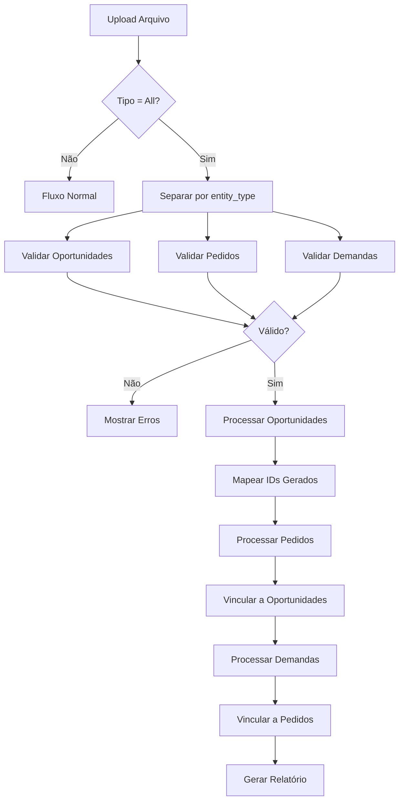

çok~2jlhj_();# Design Técnico: Importação Completa da Esteira CRM

## Visão Geral

Este documento descreve o design técnico para implementar a funcionalidade de importação multi-entidade no CRM, permitindo que usuários importem oportunidades, pedidos e demandas em uma única operação, mantendo os relacionamentos entre as entidades.

## Arquitetura da Solução

### Diagrama de Fluxo

```
┌─────────────────────────────────────────────────────────────────┐
│                    Import Manager (UI)                          │
├─────────────────────────────────────────────────────────────────┤
│  1. Upload    2. Mapping    3. Validation    4. Import    5. Result │
└─────────────────────────────────────────────────────────────────┘
                              │
                              ▼
┌─────────────────────────────────────────────────────────────────┐
│                  Server Actions Layer                           │
├─────────────────────────────────────────────────────────────────┤
│  getImportableFieldsAll()  │  validateImportDataAll()           │
│  executeImportAll()        │  suggestFieldMapping()             │
└─────────────────────────────────────────────────────────────────┘
                              │
                              ▼
┌─────────────────────────────────────────────────────────────────┐
│                  Processing Pipeline                            │
├─────────────────────────────────────────────────────────────────┤
│  1. Separar por entity_type                                     │
│  2. Processar Oportunidades → Mapear IDs gerados                │
│  3. Processar Pedidos → Vincular a Oportunidades                │
│  4. Processar Demandas → Vincular a Pedidos                     │
│  5. Gerar Relatório Consolidado                                 │
└─────────────────────────────────────────────────────────────────┘
                              │
                              ▼
┌─────────────────────────────────────────────────────────────────┐
│                     Database Layer                              │
├─────────────────────────────────────────────────────────────────┤
│  crm_opportunities  │  crm_orders  │  crm_post_sales            │
└─────────────────────────────────────────────────────────────────┘
```

### Fluxo de Processamento



## Componentes

### 1. Import Manager (UI) - Modificações

**Arquivo:** `src/components/crm/config/import-manager.tsx`

#### Alterações na Interface

1. **Seletor de Entidade:** Adicionar opção "Todas as Entidades"
2. **Alerta Multi-Entidade:** Mostrar aviso quando selecionado
3. **Resumo por Entidade:** Cards separados para cada tipo de entidade na validação
4. **Progresso Detalhado:** Indicar qual fase está sendo processada

#### Novos Estados

```typescript
// Tipos estendidos
type EntityType = 'opportunity' | 'order' | 'post_sales' | 'all';

// Novo estado para resultado multi-entidade
interface MultiEntityImportResult extends ImportResult {
  byEntity: {
    opportunity: { created: number; updated: number; skipped: number };
    order: { created: number; updated: number; skipped: number };
    post_sales: { created: number; updated: number; skipped: number };
  };
  links: { from: string; to: string; count: number }[];
}

// Novo estado para validação multi-entidade
interface MultiEntityValidationResult extends ImportValidationResult {
  byEntity: {
    opportunity: { valid: number; invalid: number };
    order: { valid: number; invalid: number };
    post_sales: { valid: number; invalid: number };
  };
}
```

### 2. Server Actions - Novas Funções

**Arquivo:** `src/lib/actions/crm-import.actions.ts`

#### getImportableFieldsAll()

```typescript
export async function getImportableFieldsAll(
  departmentId?: number
): Promise<ImportableField[]> {
  const user = await getCurrentUser();
  if (!user) return [];

  // Campo de tipo de entidade (obrigatório)
  const entityTypeField: ImportableField = {
    key: 'entity_type',
    label: 'Tipo de Entidade',
    type: 'select',
    required: true,
    options: [
      { value: 'opportunity', label: 'Oportunidade' },
      { value: 'order', label: 'Pedido' },
      { value: 'post_sales', label: 'Demanda' },
    ],
    description: 'Identifica o tipo de registro (obrigatório)',
  };

  // Campos de vinculação
  const linkFields: ImportableField[] = [
    {
      key: 'opportunity_id',
      label: 'ID da Oportunidade (vinculação)',
      type: 'text',
      required: false,
      description: 'ID numérico ou row:N para referenciar linha N do arquivo',
    },
    {
      key: 'order_id',
      label: 'ID do Pedido (vinculação)',
      type: 'text',
      required: false,
      description: 'ID numérico ou row:N para referenciar linha N do arquivo',
    },
    {
      key: 'row_reference',
      label: 'Referência da Linha',
      type: 'text',
      required: false,
      description: 'Identificador único para referência cruzada',
    },
  ];

  // Combinar campos de todas as entidades
  const allFields = new Map<string, ImportableField>();
  
  // Adicionar campo de tipo primeiro
  allFields.set(entityTypeField.key, entityTypeField);
  
  // Adicionar campos de vinculação
  for (const field of linkFields) {
    allFields.set(field.key, field);
  }

  // Adicionar campos de cada entidade (sem duplicar)
  const opportunityFields = await getImportableFields('opportunity', departmentId);
  const orderFields = await getImportableFields('order', departmentId);
  const postSalesFields = await getImportableFields('post_sales', departmentId);

  for (const field of [...opportunityFields, ...orderFields, ...postSalesFields]) {
    if (!allFields.has(field.key)) {
      allFields.set(field.key, { ...field, required: false });
    }
  }

  return Array.from(allFields.values());
}
```

#### validateImportDataAll()

```typescript
export async function validateImportDataAll(
  data: Record<string, any>[],
  mapping: ColumnMapping[],
  departmentId?: number
): Promise<MultiEntityValidationResult> {
  const user = await getCurrentUser();
  if (!user) {
    return {
      isValid: false,
      errors: [{ row: 0, field: '', message: 'Usuário não autenticado' }],
      warnings: [],
      validRows: 0,
      invalidRows: data.length,
      byEntity: {
        opportunity: { valid: 0, invalid: 0 },
        order: { valid: 0, invalid: 0 },
        post_sales: { valid: 0, invalid: 0 },
      },
    };
  }

  const errors: { row: number; field: string; message: string }[] = [];
  const warnings: { row: number; field: string; message: string }[] = [];
  
  // Separar linhas por tipo de entidade
  const entityTypeIndex = mapping.find(m => m.systemField === 'entity_type')?.csvIndex;
  
  if (entityTypeIndex === undefined) {
    return {
      isValid: false,
      errors: [{ row: 0, field: 'entity_type', message: 'Campo entity_type não mapeado' }],
      warnings: [],
      validRows: 0,
      invalidRows: data.length,
      byEntity: {
        opportunity: { valid: 0, invalid: 0 },
        order: { valid: 0, invalid: 0 },
        post_sales: { valid: 0, invalid: 0 },
      },
    };
  }

  const grouped = {
    opportunity: [] as { row: any; originalIndex: number }[],
    order: [] as { row: any; originalIndex: number }[],
    post_sales: [] as { row: any; originalIndex: number }[],
  };

  const byEntity = {
    opportunity: { valid: 0, invalid: 0 },
    order: { valid: 0, invalid: 0 },
    post_sales: { valid: 0, invalid: 0 },
  };

  // Normalizar e agrupar por tipo
  const normalizeEntityType = (value: string | null): string | null => {
    const normalized = value?.toString().toLowerCase().trim();
    const mapping: Record<string, string> = {
      'opportunity': 'opportunity',
      'oportunidade': 'opportunity',
      'order': 'order',
      'pedido': 'order',
      'post_sales': 'post_sales',
      'demanda': 'post_sales',
      'pos_venda': 'post_sales',
      'pós-venda': 'post_sales',
    };
    return mapping[normalized || ''] || null;
  };

  // Separar linhas por tipo
  for (let i = 0; i < data.length; i++) {
    const entityType = normalizeEntityType(data[i][entityTypeIndex]);
    
    if (!entityType) {
      errors.push({
        row: i + 2,
        field: 'entity_type',
        message: `Tipo de entidade inválido: ${data[i][entityTypeIndex]}`,
      });
      continue;
    }

    grouped[entityType as keyof typeof grouped].push({
      row: data[i],
      originalIndex: i,
    });
  }

  // Verificar referências cruzadas
  const opportunityIdIndex = mapping.find(m => m.systemField === 'opportunity_id')?.csvIndex;
  const orderIdIndex = mapping.find(m => m.systemField === 'order_id')?.csvIndex;

  for (let i = 0; i < data.length; i++) {
    // Validar referência de opportunity_id
    if (opportunityIdIndex !== undefined && data[i][opportunityIdIndex]) {
      const ref = data[i][opportunityIdIndex].toString();
      if (ref.startsWith('row:')) {
        const refRow = parseInt(ref.replace('row:', ''));
        if (isNaN(refRow) || refRow < 1 || refRow > data.length) {
          errors.push({
            row: i + 2,
            field: 'opportunity_id',
            message: `Referência de linha inválida: ${ref}`,
          });
        }
      }
    }

    // Validar referência de order_id
    if (orderIdIndex !== undefined && data[i][orderIdIndex]) {
      const ref = data[i][orderIdIndex].toString();
      if (ref.startsWith('row:')) {
        const refRow = parseInt(ref.replace('row:', ''));
        if (isNaN(refRow) || refRow < 1 || refRow > data.length) {
          errors.push({
            row: i + 2,
            field: 'order_id',
            message: `Referência de linha inválida: ${ref}`,
          });
        }
      }
    }
  }

  // Validar cada grupo
  for (const [entityType, rows] of Object.entries(grouped)) {
    if (rows.length === 0) continue;

    const entityData = rows.map(r => r.row);
    const result = await validateImportData(
      entityData,
      mapping,
      entityType as 'opportunity' | 'order' | 'post_sales',
      departmentId
    );

    byEntity[entityType as keyof typeof byEntity].valid = result.validRows;
    byEntity[entityType as keyof typeof byEntity].invalid = result.invalidRows;

    // Ajustar números de linha nos erros
    for (const error of result.errors) {
      const originalIndex = rows[error.row - 2]?.originalIndex;
      if (originalIndex !== undefined) {
        errors.push({ ...error, row: originalIndex + 2 });
      }
    }

    for (const warning of result.warnings) {
      const originalIndex = rows[warning.row - 2]?.originalIndex;
      if (originalIndex !== undefined) {
        warnings.push({ ...warning, row: originalIndex + 2 });
      }
    }
  }

  const validRows = byEntity.opportunity.valid + byEntity.order.valid + byEntity.post_sales.valid;
  const invalidRows = byEntity.opportunity.invalid + byEntity.order.invalid + byEntity.post_sales.invalid + errors.length;

  return {
    isValid: errors.length === 0,
    errors,
    warnings,
    validRows,
    invalidRows,
    byEntity,
  };
}
```

#### executeImportAll()

```typescript
export async function executeImportAll(
  data: Record<string, any>[],
  mapping: ColumnMapping[],
  departmentId?: number,
  mode: 'create' | 'update' | 'upsert' = 'upsert'
): Promise<MultiEntityImportResult> {
  const user = await getCurrentUser();
  if (!user) {
    return {
      success: false,
      created: 0,
      updated: 0,
      skipped: 0,
      errors: [{ row: 0, message: 'Usuário não autenticado' }],
      byEntity: {
        opportunity: { created: 0, updated: 0, skipped: 0 },
        order: { created: 0, updated: 0, skipped: 0 },
        post_sales: { created: 0, updated: 0, skipped: 0 },
      },
      links: [],
    };
  }

  const result: MultiEntityImportResult = {
    success: true,
    created: 0,
    updated: 0,
    skipped: 0,
    errors: [],
    byEntity: {
      opportunity: { created: 0, updated: 0, skipped: 0 },
      order: { created: 0, updated: 0, skipped: 0 },
      post_sales: { created: 0, updated: 0, skipped: 0 },
    },
    links: [],
  };

  // Mapa para armazenar IDs gerados por linha
  const rowIdMap = new Map<number, { type: string; id: number }>();

  const entityTypeIndex = mapping.find(m => m.systemField === 'entity_type')?.csvIndex;
  const opportunityIdIndex = mapping.find(m => m.systemField === 'opportunity_id')?.csvIndex;
  const orderIdIndex = mapping.find(m => m.systemField === 'order_id')?.csvIndex;

  // Normalizar tipo de entidade
  const normalizeEntityType = (value: string | null): string | null => {
    const normalized = value?.toString().toLowerCase().trim();
    const typeMapping: Record<string, string> = {
      'opportunity': 'opportunity',
      'oportunidade': 'opportunity',
      'order': 'order',
      'pedido': 'order',
      'post_sales': 'post_sales',
      'demanda': 'post_sales',
      'pos_venda': 'post_sales',
      'pós-venda': 'post_sales',
    };
    return typeMapping[normalized || ''] || null;
  };

  // Separar por tipo
  const grouped = {
    opportunity: [] as { row: any; originalIndex: number }[],
    order: [] as { row: any; originalIndex: number }[],
    post_sales: [] as { row: any; originalIndex: number }[],
  };

  for (let i = 0; i < data.length; i++) {
    const entityType = normalizeEntityType(data[i][entityTypeIndex!]);
    if (entityType && grouped[entityType as keyof typeof grouped]) {
      grouped[entityType as keyof typeof grouped].push({
        row: data[i],
        originalIndex: i,
      });
    }
  }

  // FASE 1: Processar Oportunidades
  for (const { row, originalIndex } of grouped.opportunity) {
    try {
      const importResult = await processOpportunityImportWithId(
        row,
        mapping,
        departmentId,
        user.email,
        mode
      );

      if (importResult.result === 'created') {
        result.created++;
        result.byEntity.opportunity.created++;
      } else if (importResult.result === 'updated') {
        result.updated++;
        result.byEntity.opportunity.updated++;
      } else {
        result.skipped++;
        result.byEntity.opportunity.skipped++;
      }

      if (importResult.id) {
        rowIdMap.set(originalIndex, { type: 'opportunity', id: importResult.id });
      }
    } catch (error: any) {
      result.errors.push({ row: originalIndex + 2, message: error.message });
      result.skipped++;
      result.byEntity.opportunity.skipped++;
    }
  }

  // FASE 2: Processar Pedidos (com vinculação a oportunidades)
  let orderOpportunityLinks = 0;
  for (const { row, originalIndex } of grouped.order) {
    try {
      // Resolver referência de opportunity_id
      let opportunityId: number | null = null;
      if (opportunityIdIndex !== undefined && row[opportunityIdIndex]) {
        const ref = row[opportunityIdIndex].toString();
        if (ref.startsWith('row:')) {
          const refRow = parseInt(ref.replace('row:', '')) - 1;
          const mapped = rowIdMap.get(refRow);
          if (mapped?.type === 'opportunity') {
            opportunityId = mapped.id;
          }
        } else {
          opportunityId = parseInt(ref) || null;
        }
      }

      const importResult = await processOrderImportWithId(
        row,
        mapping,
        departmentId,
        user.email,
        mode,
        opportunityId
      );

      if (importResult.result === 'created') {
        result.created++;
        result.byEntity.order.created++;
        if (opportunityId) orderOpportunityLinks++;
      } else if (importResult.result === 'updated') {
        result.updated++;
        result.byEntity.order.updated++;
      } else {
        result.skipped++;
        result.byEntity.order.skipped++;
      }

      if (importResult.id) {
        rowIdMap.set(originalIndex, { type: 'order', id: importResult.id });
      }
    } catch (error: any) {
      result.errors.push({ row: originalIndex + 2, message: error.message });
      result.skipped++;
      result.byEntity.order.skipped++;
    }
  }

  if (orderOpportunityLinks > 0) {
    result.links.push({
      from: 'Pedidos',
      to: 'Oportunidades',
      count: orderOpportunityLinks,
    });
  }

  // FASE 3: Processar Demandas (com vinculação a pedidos)
  let postSalesOrderLinks = 0;
  for (const { row, originalIndex } of grouped.post_sales) {
    try {
      // Resolver referência de order_id
      let orderId: number | null = null;
      if (orderIdIndex !== undefined && row[orderIdIndex]) {
        const ref = row[orderIdIndex].toString();
        if (ref.startsWith('row:')) {
          const refRow = parseInt(ref.replace('row:', '')) - 1;
          const mapped = rowIdMap.get(refRow);
          if (mapped?.type === 'order') {
            orderId = mapped.id;
          }
        } else {
          orderId = parseInt(ref) || null;
        }
      }

      const importResult = await processPostSalesImportWithId(
        row,
        mapping,
        departmentId,
        user.email,
        mode,
        orderId
      );

      if (importResult.result === 'created') {
        result.created++;
        result.byEntity.post_sales.created++;
        if (orderId) postSalesOrderLinks++;
      } else if (importResult.result === 'updated') {
        result.updated++;
        result.byEntity.post_sales.updated++;
      } else {
        result.skipped++;
        result.byEntity.post_sales.skipped++;
      }
    } catch (error: any) {
      result.errors.push({ row: originalIndex + 2, message: error.message });
      result.skipped++;
      result.byEntity.post_sales.skipped++;
    }
  }

  if (postSalesOrderLinks > 0) {
    result.links.push({
      from: 'Demandas',
      to: 'Pedidos',
      count: postSalesOrderLinks,
    });
  }

  result.success = result.errors.length === 0;

  // Revalidar caminhos
  revalidatePath('/crm/opportunities');
  revalidatePath('/crm/orders');
  revalidatePath('/crm/post-sales');

  return result;
}
```

## Modelos de Dados

### Tipos TypeScript

```typescript
// Tipo de entidade estendido
type EntityType = 'opportunity' | 'order' | 'post_sales' | 'all';

// Resultado de importação com ID retornado
interface ImportResultWithId {
  result: 'created' | 'updated' | 'skipped';
  id?: number;
}

// Resultado multi-entidade
interface MultiEntityImportResult extends ImportResult {
  byEntity: {
    opportunity: { created: number; updated: number; skipped: number };
    order: { created: number; updated: number; skipped: number };
    post_sales: { created: number; updated: number; skipped: number };
  };
  links: { from: string; to: string; count: number }[];
}

// Validação multi-entidade
interface MultiEntityValidationResult extends ImportValidationResult {
  byEntity: {
    opportunity: { valid: number; invalid: number };
    order: { valid: number; invalid: number };
    post_sales: { valid: number; invalid: number };
  };
}
```

### Estrutura do Arquivo de Importação

```csv
entity_type,client_cnpj,status_name,value,total_value,opportunity_id,order_id,notes
opportunity,12345678000190,Qualificação,50000,,,,"Nova oportunidade"
opportunity,98765432000110,Proposta,75000,,,,"Outra oportunidade"
order,12345678000190,Em Processamento,,50000,row:1,,"Pedido da linha 1"
order,98765432000110,Aprovado,,75000,row:2,,"Pedido da linha 2"
post_sales,12345678000190,Aguardando,,,row:1,row:3,"Demanda do pedido linha 3"
post_sales,98765432000110,Instalação,,,row:2,row:4,"Demanda do pedido linha 4"
```

## Tratamento de Erros

| Cenário | Comportamento |
|---------|---------------|
| `entity_type` não mapeado | Erro na validação, importação bloqueada |
| `entity_type` inválido | Erro na linha, pular registro |
| Referência `row:N` inválida | Erro na linha, pular registro |
| Cliente não encontrado | Erro na linha, pular registro |
| Status não encontrado | Erro na linha, pular registro |
| ID referenciado não existe | Warning, criar sem vínculo |

## Considerações de Performance

1. **Processamento em Lotes:** Processar em lotes de 100 registros
2. **Transações:** Usar transações para garantir consistência
3. **Cache de Status:** Carregar todos os status uma vez no início
4. **Mapa de IDs:** Manter mapa em memória para referências cruzadas

## Segurança

- Validar permissões do usuário para cada tipo de entidade
- Sanitizar todos os inputs
- Limitar tamanho máximo do arquivo (10MB)
- Limitar número máximo de linhas (10.000)

## Correctness Properties

*A property is a characteristic or behavior that should hold true across all valid executions of a system-essentially, a formal statement about what the system should do. Properties serve as the bridge between human-readable specifications and machine-verifiable correctness guarantees.*

### Property 1: Entity Type Normalization Consistency
*For any* valid entity type string (including aliases like "oportunidade", "pedido", "demanda"), normalizing it should always return one of the canonical types: "opportunity", "order", or "post_sales".
**Validates: Requirements US-2.3**

### Property 2: Processing Order Preservation
*For any* multi-entity import file, opportunities are always processed before orders, and orders are always processed before post_sales, regardless of their order in the input file.
**Validates: Requirements US-4.1, US-4.2, US-4.3**

### Property 3: Row Reference Resolution
*For any* valid row reference in format "row:N", if line N contains an entity of the expected type, the reference should resolve to the ID generated for that entity.
**Validates: Requirements US-4.4, US-4.5**

### Property 4: Entity Count Consistency
*For any* import operation, the sum of created + updated + skipped for each entity type should equal the total number of rows of that entity type in the input file.
**Validates: Requirements US-6.1**

### Property 5: Link Count Accuracy
*For any* import operation, the number of links reported between entities should equal the number of successfully resolved references.
**Validates: Requirements US-6.2**

### Property 6: Validation Completeness
*For any* input file, validation should identify all rows with missing required fields, invalid entity types, and invalid row references before import begins.
**Validates: Requirements US-5.1, US-5.2, US-5.3**

## Error Handling

### Estratégia de Erros

1. **Erros de Validação:** Coletados e exibidos antes da importação
2. **Erros de Processamento:** Registrados por linha, não interrompem outras linhas
3. **Erros Críticos:** Interrompem toda a importação (ex: usuário não autenticado)

### Mensagens de Erro

| Código | Mensagem | Ação |
|--------|----------|------|
| E001 | Campo entity_type não mapeado | Bloquear importação |
| E002 | Tipo de entidade inválido: {valor} | Pular linha |
| E003 | Referência de linha inválida: {ref} | Pular linha |
| E004 | Cliente não encontrado | Pular linha |
| E005 | Status não encontrado: {status} | Pular linha |
| W001 | CNPJ com formato inválido | Aviso, continuar |
| W002 | Referência não resolvida | Aviso, criar sem vínculo |

## Testing Strategy

### Testes Unitários

1. **normalizeEntityType():** Testar todos os aliases e valores inválidos
2. **validateImportDataAll():** Testar validação de cada tipo de entidade
3. **executeImportAll():** Testar processamento ordenado e vinculação

### Testes de Integração

1. **Fluxo completo:** Upload → Mapeamento → Validação → Importação → Resultado
2. **Referências cruzadas:** Verificar que vínculos são criados corretamente
3. **Rollback:** Verificar comportamento em caso de erro parcial

### Testes de Property-Based

1. **Normalização:** Gerar strings aleatórias e verificar normalização
2. **Ordem de processamento:** Gerar arquivos com ordem aleatória e verificar processamento
3. **Contagem:** Verificar que totais batem com entrada

### Configuração de Testes

- Framework: Vitest
- Mínimo 100 iterações por teste de propriedade
- Cobertura mínima: 80% das funções críticas
