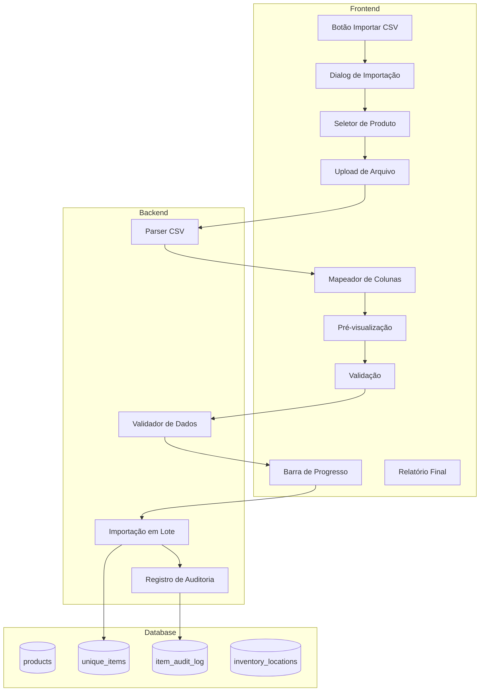

# Design Document: Importação CSV de Itens Únicos

## Overview

Sistema de importação em massa de itens únicos via CSV com mapeamento dinâmico de colunas. O usuário faz upload de um arquivo CSV, mapeia as colunas visualmente para os campos do sistema, valida os dados e importa em lote.

## Architecture



## Components

### 1. CSVImportDialog (Frontend)

```typescript
// src/components/crm/inventory/csv-import-dialog.tsx
interface CSVImportDialogProps {
  open: boolean;
  onOpenChange: (open: boolean) => void;
  onSuccess: () => void;
  preselectedProductId?: number;
}

// Estados do wizard
type ImportStep = 'product' | 'upload' | 'mapping' | 'validation' | 'importing' | 'complete';
```

### 2. CSV Parser Utility

```typescript
// src/lib/utils/csv-parser.ts
interface ParsedCSV {
  headers: string[];
  rows: string[][];
  delimiter: string;
  encoding: string;
  totalRows: number;
}

function parseCSV(file: File): Promise<ParsedCSV>
function detectDelimiter(content: string): string
function detectEncoding(buffer: ArrayBuffer): string
```

### 3. Column Mapping

```typescript
// Campos disponíveis para mapeamento
const MAPPABLE_FIELDS = [
  { key: 'unique_identifier', label: 'Identificador Único', required: true },
  { key: 'batch_number', label: 'Lote', required: false },
  { key: 'location', label: 'Localização', required: false },
  { key: 'purchase_date', label: 'Data de Compra', required: false },
  { key: 'purchase_price', label: 'Preço de Compra', required: false },
  { key: 'supplier', label: 'Fornecedor', required: false },
  { key: 'notes', label: 'Observações', required: false },
];

interface ColumnMapping {
  csvColumn: string;
  systemField: string | null; // null = ignorar
}
```

### 4. Server Action para Importação

```typescript
// src/lib/actions/csv-import.actions.ts
interface ImportResult {
  success: boolean;
  imported: number;
  failed: number;
  errors: Array<{ row: number; error: string }>;
}

async function importUniqueItemsFromCSV(
  productId: number,
  items: Array<Record<string, any>>,
  fileName: string
): Promise<ImportResult>
```

## Data Flow

1. **Upload**: Usuário seleciona arquivo CSV
2. **Parse**: Sistema detecta delimitador e encoding, extrai headers e linhas
3. **Mapping**: Usuário mapeia colunas do CSV para campos do sistema
4. **Validation**: Sistema valida dados (duplicados, conflitos, campos obrigatórios)
5. **Import**: Sistema importa em lotes de 100, registrando progresso
6. **Report**: Sistema exibe relatório final com sucessos e falhas

## UI/UX Design

### Wizard Steps

1. **Seleção de Produto**: Dropdown com produtos serializados
2. **Upload**: Área de drag & drop + botão de seleção
3. **Mapeamento**: Tabela com colunas do CSV e dropdowns para campos
4. **Validação**: Resumo de erros e opção de prosseguir
5. **Importação**: Barra de progresso
6. **Conclusão**: Relatório final

## Error Handling

- Arquivo inválido: Mensagem clara com formato esperado
- Duplicados no arquivo: Lista de linhas duplicadas
- Conflitos com banco: Lista de identificadores já existentes
- Falhas na importação: Log detalhado por linha

## Testing Strategy

- Testes unitários para parser CSV
- Testes de integração para importação em lote
- Testes E2E para fluxo completo do wizard
