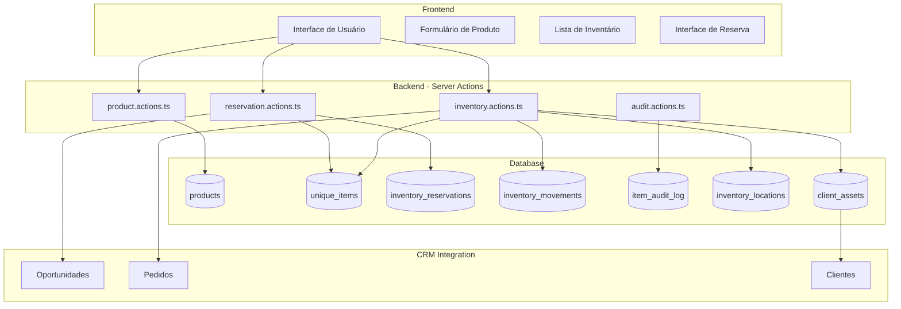
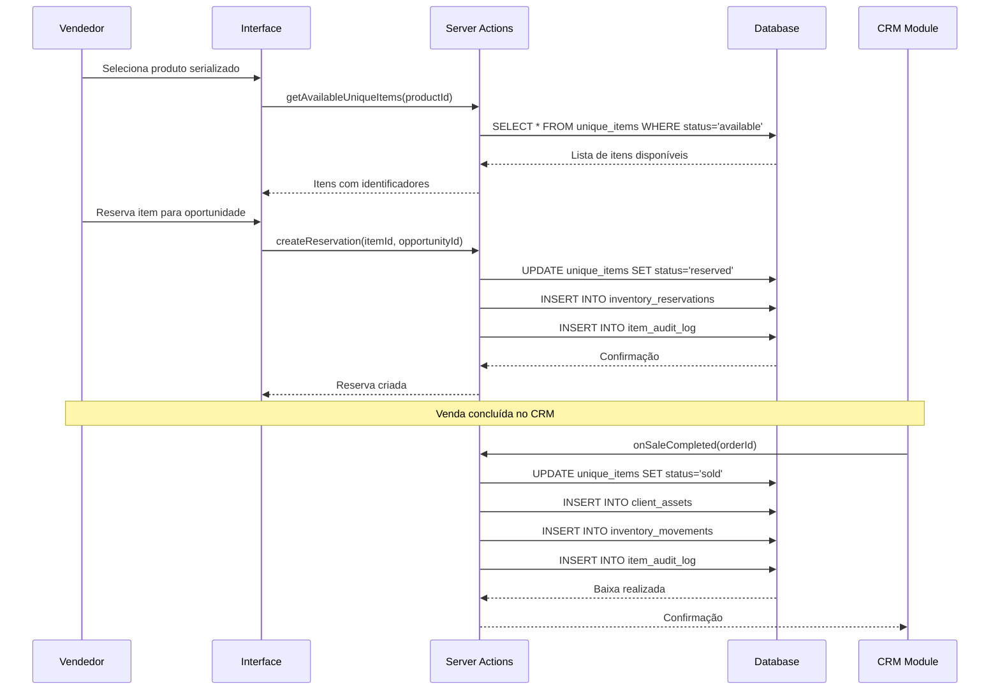
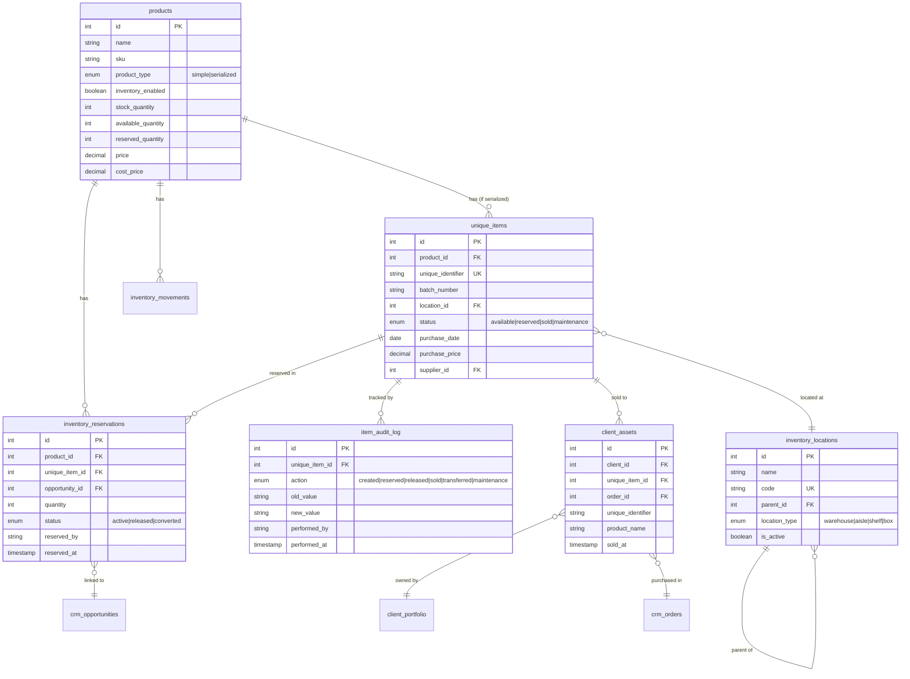

# Design Document: Sistema Híbrido de Inventário e Rastreabilidade de Ativos

## Overview

Este documento descreve o design técnico para a refatoração do módulo de Estoque do Portal S4A, transformando-o em um sistema híbrido que suporta tanto controle de inventário por quantidade (produtos simples) quanto rastreabilidade individual de ativos (produtos serializados).

O sistema será integrado ao CRM existente, permitindo reservas vinculadas a oportunidades, baixas automatizadas em vendas concluídas e histórico completo de ativos por cliente.

## Architecture

### Visão Geral da Arquitetura



### Fluxo de Dados Principal




## Components and Interfaces

### 1. Schemas (Zod Validation)

#### ProductSchema Atualizado

```typescript
// src/lib/schemas/product.ts
export const ProductTypeSchema = z.enum(['simple', 'serialized']);
export type ProductType = z.infer<typeof ProductTypeSchema>;

export const ProductSchema = z.object({
  id: z.number().optional(),
  name: z.string().min(1, 'Nome é obrigatório'),
  description: z.string().optional(),
  price: z.coerce.number().min(0, 'Preço deve ser maior ou igual a zero'),
  sku: z.string().optional(),
  category_id: z.coerce.number().optional(),
  
  // Novos campos para estoque híbrido
  product_type: ProductTypeSchema.default('simple'),
  inventory_enabled: z.boolean().default(false),
  stock_quantity: z.coerce.number().int().min(0).default(0),
  available_quantity: z.coerce.number().int().min(0).default(0),
  reserved_quantity: z.coerce.number().int().min(0).default(0),
  
  // Campos existentes
  min_stock_quantity: z.coerce.number().int().min(0).default(0),
  max_stock_quantity: z.coerce.number().int().optional(),
  reorder_point: z.coerce.number().int().default(0),
  cost_price: z.coerce.number().min(0).default(0),
  status: z.enum(['active', 'inactive']).default('active'),
  
  // Multi-departamento
  operation_id: z.number().optional(),
  department_ids: z.array(z.number()).optional(),
  
  created_at: z.date().optional(),
  updated_at: z.date().optional(),
});
```

#### UniqueItemSchema (Novo)

```typescript
// src/lib/schemas/inventory.ts
export const UniqueItemStatusSchema = z.enum([
  'available',    // Disponível
  'reserved',     // Reservado
  'sold',         // Vendido
  'maintenance',  // Manutenção
]);
export type UniqueItemStatus = z.infer<typeof UniqueItemStatusSchema>;

export const UniqueItemSchema = z.object({
  id: z.number().optional(),
  product_id: z.number({ required_error: 'Produto é obrigatório' }),
  unique_identifier: z.string().min(1, 'Identificador único é obrigatório'),
  batch_number: z.string().optional(), // Lote
  location_id: z.number().optional(),
  status: UniqueItemStatusSchema.default('available'),
  
  // Metadados
  purchase_date: z.date().optional(),
  purchase_price: z.coerce.number().min(0).optional(),
  supplier_id: z.number().optional(),
  notes: z.string().optional(),
  
  created_by: z.string().optional(),
  created_at: z.date().optional(),
  updated_at: z.date().optional(),
});

export type UniqueItem = z.infer<typeof UniqueItemSchema>;
```

#### ReservationSchema (Novo)

```typescript
// src/lib/schemas/inventory.ts
export const InventoryReservationSchema = z.object({
  id: z.number().optional(),
  product_id: z.number({ required_error: 'Produto é obrigatório' }),
  unique_item_id: z.number().optional(), // Apenas para serializados
  opportunity_id: z.number({ required_error: 'Oportunidade é obrigatória' }),
  quantity: z.coerce.number().int().min(1).default(1), // Para simples
  
  status: z.enum(['active', 'released', 'converted']).default('active'),
  reserved_by: z.string().optional(),
  reserved_at: z.date().optional(),
  released_at: z.date().optional(),
  converted_at: z.date().optional(), // Quando vira venda
  
  created_at: z.date().optional(),
  updated_at: z.date().optional(),
});

export type InventoryReservation = z.infer<typeof InventoryReservationSchema>;
```

#### LocationSchema (Novo)

```typescript
// src/lib/schemas/inventory.ts
export const InventoryLocationSchema = z.object({
  id: z.number().optional(),
  name: z.string().min(1, 'Nome é obrigatório'),
  code: z.string().min(1, 'Código é obrigatório'),
  parent_id: z.number().optional(), // Para hierarquia
  location_type: z.enum(['warehouse', 'aisle', 'shelf', 'box']).default('warehouse'),
  description: z.string().optional(),
  is_active: z.boolean().default(true),
  
  created_at: z.date().optional(),
  updated_at: z.date().optional(),
});

export type InventoryLocation = z.infer<typeof InventoryLocationSchema>;
```


### 2. Server Actions

#### Estrutura de Actions

```
src/lib/actions/
├── inventory.actions.ts      # Movimentações e estoque geral (existente, expandir)
├── unique-items.actions.ts   # CRUD de itens únicos (novo)
├── reservations.actions.ts   # Sistema de reservas (novo)
├── locations.actions.ts      # Gestão de localizações (novo)
└── client-assets.actions.ts  # Histórico de ativos do cliente (novo)
```

#### Principais Funções

```typescript
// unique-items.actions.ts
export async function createUniqueItem(data: UniqueItem): Promise<ActionResult>
export async function updateUniqueItem(id: number, data: Partial<UniqueItem>): Promise<ActionResult>
export async function deleteUniqueItem(id: number): Promise<ActionResult>
export async function getUniqueItems(productId: number): Promise<UniqueItem[]>
export async function getAvailableUniqueItems(productId: number): Promise<UniqueItem[]>
export async function searchUniqueItems(query: string): Promise<UniqueItemSearchResult[]>
export async function transferUniqueItem(itemId: number, newLocationId: number): Promise<ActionResult>
export async function bulkCreateUniqueItems(productId: number, items: UniqueItemInput[]): Promise<ActionResult>

// reservations.actions.ts
export async function createReservation(data: InventoryReservation): Promise<ActionResult>
export async function releaseReservation(reservationId: number): Promise<ActionResult>
export async function convertReservationToSale(reservationId: number, orderId: number): Promise<ActionResult>
export async function getReservationsByOpportunity(opportunityId: number): Promise<InventoryReservation[]>
export async function getReservationsByProduct(productId: number): Promise<InventoryReservation[]>

// client-assets.actions.ts
export async function getClientAssets(clientId: number): Promise<ClientAsset[]>
export async function searchClientByAsset(uniqueIdentifier: string): Promise<Client | null>
export async function recordAssetSale(clientId: number, uniqueItemId: number, orderId: number): Promise<ActionResult>
```

### 3. Componentes React

#### Estrutura de Componentes

```
src/components/crm/inventory/
├── inventory-page-client.tsx       # Página principal (refatorar)
├── product-type-selector.tsx       # Seletor Simples/Serializado (novo)
├── unique-items-table.tsx          # Tabela de itens únicos (novo)
├── unique-item-form.tsx            # Formulário de item único (novo)
├── inventory-list-grouped.tsx      # Lista agrupada por produto (novo)
├── global-search.tsx               # Busca global (novo)
├── reservation-dialog.tsx          # Dialog de reserva (novo)
├── location-manager.tsx            # Gestão de localizações (novo)
├── item-timeline.tsx               # Timeline de auditoria (novo)
└── inventory-metrics.tsx           # Cards de métricas (novo)
```

#### Componente Principal: InventoryListGrouped

```typescript
// Estrutura do componente de lista agrupada
interface ProductGroup {
  product: Product;
  totalQuantity: number;
  availableQuantity: number;
  reservedQuantity: number;
  uniqueItems?: UniqueItem[]; // Apenas para serializados
  isExpanded: boolean;
}

// Props do componente
interface InventoryListGroupedProps {
  products: ProductGroup[];
  onExpand: (productId: number) => void;
  onReserve: (productId: number, itemId?: number) => void;
  onTransfer: (itemId: number) => void;
  searchQuery: string;
}
```


## Data Models

### Diagrama de Entidade-Relacionamento



### SQL Migration

```sql
-- Migration: 004_hybrid_inventory_system.sql

-- 1. Atualizar tabela products
ALTER TABLE products 
ADD COLUMN IF NOT EXISTS product_type TEXT DEFAULT 'simple' 
  CHECK (product_type IN ('simple', 'serialized'));

ALTER TABLE products 
ADD COLUMN IF NOT EXISTS inventory_enabled BOOLEAN DEFAULT FALSE;

ALTER TABLE products 
ADD COLUMN IF NOT EXISTS available_quantity INTEGER DEFAULT 0;

ALTER TABLE products 
ADD COLUMN IF NOT EXISTS reserved_quantity INTEGER DEFAULT 0;

-- 2. Criar tabela de localizações
CREATE TABLE IF NOT EXISTS inventory_locations (
  id SERIAL PRIMARY KEY,
  name TEXT NOT NULL,
  code TEXT NOT NULL UNIQUE,
  parent_id INTEGER REFERENCES inventory_locations(id),
  location_type TEXT DEFAULT 'warehouse' 
    CHECK (location_type IN ('warehouse', 'aisle', 'shelf', 'box')),
  description TEXT,
  is_active BOOLEAN DEFAULT TRUE,
  created_at TIMESTAMPTZ DEFAULT NOW(),
  updated_at TIMESTAMPTZ DEFAULT NOW()
);

-- 3. Criar tabela de itens únicos
CREATE TABLE IF NOT EXISTS unique_items (
  id SERIAL PRIMARY KEY,
  product_id INTEGER NOT NULL REFERENCES products(id) ON DELETE CASCADE,
  unique_identifier TEXT NOT NULL,
  batch_number TEXT,
  location_id INTEGER REFERENCES inventory_locations(id),
  status TEXT DEFAULT 'available' 
    CHECK (status IN ('available', 'reserved', 'sold', 'maintenance')),
  purchase_date DATE,
  purchase_price DECIMAL(15, 2),
  supplier_id INTEGER REFERENCES suppliers(id),
  notes TEXT,
  created_by TEXT,
  created_at TIMESTAMPTZ DEFAULT NOW(),
  updated_at TIMESTAMPTZ DEFAULT NOW(),
  
  CONSTRAINT unique_identifier_global UNIQUE (unique_identifier)
);

-- 4. Criar tabela de reservas
CREATE TABLE IF NOT EXISTS inventory_reservations (
  id SERIAL PRIMARY KEY,
  product_id INTEGER NOT NULL REFERENCES products(id) ON DELETE CASCADE,
  unique_item_id INTEGER REFERENCES unique_items(id),
  opportunity_id INTEGER NOT NULL REFERENCES crm_opportunities(id) ON DELETE CASCADE,
  quantity INTEGER DEFAULT 1,
  status TEXT DEFAULT 'active' 
    CHECK (status IN ('active', 'released', 'converted')),
  reserved_by TEXT,
  reserved_at TIMESTAMPTZ DEFAULT NOW(),
  released_at TIMESTAMPTZ,
  converted_at TIMESTAMPTZ,
  created_at TIMESTAMPTZ DEFAULT NOW(),
  updated_at TIMESTAMPTZ DEFAULT NOW()
);

-- 5. Criar tabela de auditoria de itens
CREATE TABLE IF NOT EXISTS item_audit_log (
  id SERIAL PRIMARY KEY,
  unique_item_id INTEGER NOT NULL REFERENCES unique_items(id) ON DELETE CASCADE,
  action TEXT NOT NULL 
    CHECK (action IN ('created', 'reserved', 'released', 'sold', 'transferred', 'maintenance', 'updated')),
  old_value JSONB,
  new_value JSONB,
  performed_by TEXT NOT NULL,
  performed_at TIMESTAMPTZ DEFAULT NOW()
);

-- 6. Criar tabela de ativos do cliente
CREATE TABLE IF NOT EXISTS client_assets (
  id SERIAL PRIMARY KEY,
  client_id INTEGER NOT NULL REFERENCES client_portfolio(id) ON DELETE CASCADE,
  unique_item_id INTEGER REFERENCES unique_items(id),
  order_id INTEGER REFERENCES crm_orders(id),
  unique_identifier TEXT NOT NULL,
  product_name TEXT NOT NULL,
  product_sku TEXT,
  sold_at TIMESTAMPTZ DEFAULT NOW(),
  notes TEXT,
  created_at TIMESTAMPTZ DEFAULT NOW()
);

-- 7. Criar tabela de configuração de rótulos
CREATE TABLE IF NOT EXISTS inventory_settings (
  id SERIAL PRIMARY KEY,
  setting_key TEXT NOT NULL UNIQUE,
  setting_value TEXT NOT NULL,
  updated_at TIMESTAMPTZ DEFAULT NOW()
);

-- Inserir configuração padrão do rótulo
INSERT INTO inventory_settings (setting_key, setting_value) 
VALUES ('unique_identifier_label', 'Serial/IMEI')
ON CONFLICT (setting_key) DO NOTHING;

-- 8. Índices para performance
CREATE INDEX IF NOT EXISTS idx_unique_items_product ON unique_items(product_id);
CREATE INDEX IF NOT EXISTS idx_unique_items_status ON unique_items(status);
CREATE INDEX IF NOT EXISTS idx_unique_items_identifier ON unique_items(unique_identifier);
CREATE INDEX IF NOT EXISTS idx_unique_items_batch ON unique_items(batch_number);
CREATE INDEX IF NOT EXISTS idx_unique_items_location ON unique_items(location_id);

CREATE INDEX IF NOT EXISTS idx_reservations_product ON inventory_reservations(product_id);
CREATE INDEX IF NOT EXISTS idx_reservations_opportunity ON inventory_reservations(opportunity_id);
CREATE INDEX IF NOT EXISTS idx_reservations_status ON inventory_reservations(status);

CREATE INDEX IF NOT EXISTS idx_audit_log_item ON item_audit_log(unique_item_id);
CREATE INDEX IF NOT EXISTS idx_audit_log_action ON item_audit_log(action);

CREATE INDEX IF NOT EXISTS idx_client_assets_client ON client_assets(client_id);
CREATE INDEX IF NOT EXISTS idx_client_assets_identifier ON client_assets(unique_identifier);

-- 9. Função para atualizar quantidade do produto
CREATE OR REPLACE FUNCTION update_product_quantities()
RETURNS TRIGGER AS $$
BEGIN
  -- Atualizar quantidades do produto pai
  UPDATE products SET
    stock_quantity = (
      SELECT COUNT(*) FROM unique_items 
      WHERE product_id = COALESCE(NEW.product_id, OLD.product_id)
      AND status IN ('available', 'reserved')
    ),
    available_quantity = (
      SELECT COUNT(*) FROM unique_items 
      WHERE product_id = COALESCE(NEW.product_id, OLD.product_id)
      AND status = 'available'
    ),
    reserved_quantity = (
      SELECT COUNT(*) FROM unique_items 
      WHERE product_id = COALESCE(NEW.product_id, OLD.product_id)
      AND status = 'reserved'
    ),
    updated_at = NOW()
  WHERE id = COALESCE(NEW.product_id, OLD.product_id);
  
  RETURN COALESCE(NEW, OLD);
END;
$$ LANGUAGE plpgsql;

-- 10. Triggers para manter consistência
DROP TRIGGER IF EXISTS trigger_update_product_quantities ON unique_items;
CREATE TRIGGER trigger_update_product_quantities
AFTER INSERT OR UPDATE OR DELETE ON unique_items
FOR EACH ROW EXECUTE FUNCTION update_product_quantities();
```


## Correctness Properties

*A property is a characteristic or behavior that should hold true across all valid executions of a system—essentially, a formal statement about what the system should do. Properties serve as the bridge between human-readable specifications and machine-verifiable correctness guarantees.*

### Property 1: Consistência de Quantidade para Produtos Serializados

*For any* produto serializado com integração de estoque habilitada, a quantidade em estoque (`stock_quantity`) deve ser igual à soma de itens únicos com status 'available' ou 'reserved', e a quantidade disponível (`available_quantity`) deve ser igual ao número de itens com status 'available'.

**Validates: Requirements 2.6, 2.7**

### Property 2: Unicidade Global de Identificadores

*For any* identificador único criado no sistema, não deve existir outro item único com o mesmo identificador, independentemente do produto ao qual pertence.

**Validates: Requirements 2.3**

### Property 3: Transição de Status em Reserva

*For any* reserva criada para um item único de produto serializado, o status do item deve mudar de 'available' para 'reserved', e itens com status diferente de 'available' devem ser rejeitados na tentativa de reserva.

**Validates: Requirements 4.3, 4.6**

### Property 4: Liberação de Reserva (Round-Trip)

*For any* item único que foi reservado para uma oportunidade, quando a oportunidade é cancelada, o status do item deve retornar para 'available' e a reserva deve ser marcada como 'released'.

**Validates: Requirements 4.5**

### Property 5: Baixa Automatizada em Venda

*For any* venda concluída no CRM que possui itens reservados, o sistema deve: (1) decrementar o estoque para produtos simples, (2) alterar status para 'sold' para itens serializados, (3) registrar o ativo no histórico do cliente, e (4) criar um registro de movimentação do tipo 'out'.

**Validates: Requirements 7.1, 7.2, 7.3, 7.4, 7.5**

### Property 6: Busca Global por Substring

*For any* substring de um identificador único, lote, SKU ou nome de produto existente no sistema, a função de busca global deve retornar o item correspondente nos resultados.

**Validates: Requirements 6.2, 6.4**

### Property 7: Sincronização Produto-Estoque

*For any* produto com integração de estoque habilitada, alterações na quantidade de itens únicos devem ser refletidas automaticamente nos campos de quantidade do produto, e vice-versa para produtos simples.

**Validates: Requirements 13.3**

### Property 8: Imutabilidade de Auditoria

*For any* alteração de status, localização ou qualquer atributo de um item único, um registro de auditoria deve ser criado com timestamp e usuário, e registros de auditoria existentes não podem ser modificados ou excluídos.

**Validates: Requirements 12.1, 12.6**

### Property 9: Validação de Tipo de Produto

*For any* produto do tipo 'serialized' que possui itens únicos vinculados, a tentativa de alterar o tipo para 'simple' deve ser rejeitada pelo sistema.

**Validates: Requirements 1.5**

### Property 10: Reserva de Quantidade para Produtos Simples

*For any* reserva criada para um produto simples, a quantidade reservada deve ser subtraída da quantidade disponível, e a soma de quantidade disponível + quantidade reservada deve permanecer igual à quantidade total em estoque.

**Validates: Requirements 4.2**


## Error Handling

### Categorias de Erros

#### 1. Erros de Validação
- **Identificador duplicado**: Retornar erro específico com o identificador conflitante
- **Quantidade insuficiente**: Informar quantidade disponível vs solicitada
- **Item não disponível**: Informar status atual do item
- **Tipo de produto inválido**: Impedir alteração com itens vinculados

#### 2. Erros de Negócio
- **Reserva de item já reservado**: Informar oportunidade que detém a reserva
- **Baixa sem reserva**: Permitir baixa manual com confirmação
- **Localização inexistente**: Sugerir criação ou seleção de existente

#### 3. Erros de Sistema
- **Falha na baixa automatizada**: Manter venda em estado pendente, notificar usuário
- **Inconsistência de quantidade**: Trigger de reconciliação automática
- **Timeout em operações**: Retry com backoff exponencial

### Estratégia de Tratamento

```typescript
// Padrão de retorno de actions
interface ActionResult<T = void> {
  success: boolean;
  data?: T;
  error?: string;
  errorCode?: 'DUPLICATE_IDENTIFIER' | 'INSUFFICIENT_STOCK' | 'ITEM_NOT_AVAILABLE' | 
              'ITEM_ALREADY_RESERVED' | 'INVALID_TYPE_CHANGE' | 'LOCATION_NOT_FOUND' |
              'SALE_PENDING_STOCK' | 'PERMISSION_DENIED';
  details?: Record<string, any>;
}

// Exemplo de tratamento
export async function createUniqueItem(data: UniqueItem): Promise<ActionResult<UniqueItem>> {
  try {
    // Validar unicidade
    const existing = await db`
      SELECT id FROM unique_items WHERE unique_identifier = ${data.unique_identifier}
    `;
    
    if (existing.length > 0) {
      return {
        success: false,
        error: 'Identificador já existe no sistema',
        errorCode: 'DUPLICATE_IDENTIFIER',
        details: { existingId: existing[0].id }
      };
    }
    
    // Criar item...
    return { success: true, data: createdItem };
  } catch (error) {
    console.error('Error creating unique item:', error);
    return { success: false, error: 'Erro interno ao criar item' };
  }
}
```

## Testing Strategy

### Abordagem de Testes

O sistema utilizará uma combinação de:
1. **Testes Unitários**: Para funções de validação e transformação de dados
2. **Testes de Propriedade (PBT)**: Para validar invariantes do sistema
3. **Testes de Integração**: Para fluxos completos de reserva e baixa

### Framework de Testes

- **Vitest**: Framework principal de testes
- **fast-check**: Biblioteca de property-based testing para TypeScript

### Configuração de Property Tests

```typescript
// vitest.config.ts
export default defineConfig({
  test: {
    // Mínimo 100 iterações por property test
    fuzz: {
      numRuns: 100
    }
  }
});
```

### Estrutura de Testes

```
src/__tests__/
├── properties/
│   └── inventory/
│       ├── quantity-consistency.property.test.ts
│       ├── identifier-uniqueness.property.test.ts
│       ├── reservation-status.property.test.ts
│       ├── sale-writeoff.property.test.ts
│       └── global-search.property.test.ts
├── integration/
│   └── inventory/
│       ├── reservation-flow.test.ts
│       ├── sale-completion.test.ts
│       └── product-type-change.test.ts
└── unit/
    └── inventory/
        ├── schemas.test.ts
        └── validators.test.ts
```

### Exemplo de Property Test

```typescript
// quantity-consistency.property.test.ts
import { fc } from '@fast-check/vitest';
import { describe, it, expect } from 'vitest';

describe('Property 1: Consistência de Quantidade para Produtos Serializados', () => {
  /**
   * Feature: hybrid-inventory-asset-tracking
   * Property 1: Para qualquer produto serializado, stock_quantity deve ser igual
   * à soma de itens com status 'available' ou 'reserved'
   * Validates: Requirements 2.6, 2.7
   */
  it.prop([
    fc.array(fc.record({
      status: fc.constantFrom('available', 'reserved', 'sold', 'maintenance')
    }), { minLength: 0, maxLength: 100 })
  ])('quantidade deve ser consistente com itens únicos', async (items) => {
    // Arrange: criar produto serializado com itens
    const product = await createTestSerializedProduct();
    
    for (const item of items) {
      await createTestUniqueItem(product.id, item.status);
    }
    
    // Act: buscar produto atualizado
    const updatedProduct = await getProduct(product.id);
    
    // Assert: verificar consistência
    const expectedStock = items.filter(i => 
      i.status === 'available' || i.status === 'reserved'
    ).length;
    
    const expectedAvailable = items.filter(i => i.status === 'available').length;
    const expectedReserved = items.filter(i => i.status === 'reserved').length;
    
    expect(updatedProduct.stock_quantity).toBe(expectedStock);
    expect(updatedProduct.available_quantity).toBe(expectedAvailable);
    expect(updatedProduct.reserved_quantity).toBe(expectedReserved);
  });
});
```

### Cobertura de Testes por Propriedade

| Propriedade | Tipo de Teste | Arquivo |
|-------------|---------------|---------|
| P1: Consistência de Quantidade | Property | quantity-consistency.property.test.ts |
| P2: Unicidade de Identificadores | Property | identifier-uniqueness.property.test.ts |
| P3: Transição de Status em Reserva | Property | reservation-status.property.test.ts |
| P4: Liberação de Reserva | Property | reservation-roundtrip.property.test.ts |
| P5: Baixa Automatizada | Property + Integration | sale-writeoff.property.test.ts |
| P6: Busca Global | Property | global-search.property.test.ts |
| P7: Sincronização Produto-Estoque | Property | sync-consistency.property.test.ts |
| P8: Imutabilidade de Auditoria | Property | audit-immutability.property.test.ts |
| P9: Validação de Tipo de Produto | Property | product-type-validation.property.test.ts |
| P10: Reserva de Quantidade Simples | Property | simple-reservation.property.test.ts |
