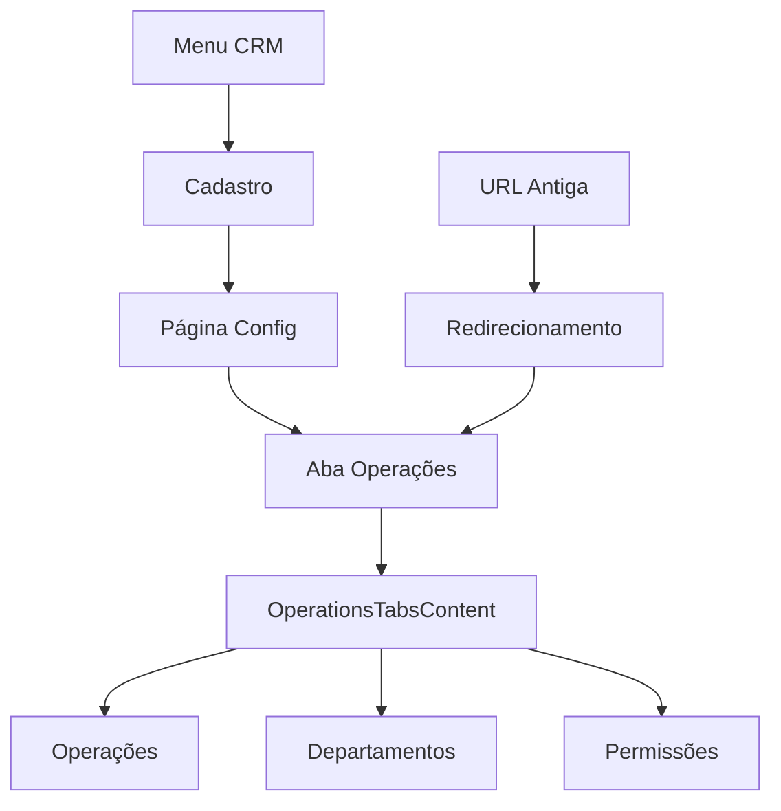

# Design da Reestruturação da Navegação CRM

**Data:** 10/12/2025  
**Status:** 🎨 Design  
**Baseado em:** navigation-restructure.md  
**Complexidade:** 🟢 Baixa

---

## 📋 Visão Geral

Este documento detalha o design técnico para reorganizar a navegação do CRM, movendo "Operações e Departamentos" para dentro da seção "Cadastro" e consolidando todas as funcionalidades de configuração.

## 🏗️ Arquitetura da Solução

### Componentes Afetados

```
src/
├── config/
│   └── routes.ts ← Modificar estrutura de navegação
├── app/crm/config/
│   ├── page.tsx ← Adicionar aba "Operações"
│   └── operations/
│       └── page.tsx ← Transformar em redirecionamento
└── components/crm/config/
    └── operations-tabs-content.tsx ← NOVO componente
```

### Fluxo de Dados



---

## 🎨 Design de Interface

### Estrutura de Abas Atual vs Nova

#### Atual (src/app/crm/config/page.tsx)
```typescript
<TabsList className="space-x-2">
  <TabsTrigger value="products">Produtos</TabsTrigger>
  <TabsTrigger value="categories">Categorias</TabsTrigger>
  <TabsTrigger value="statuses">Status e Etapas</TabsTrigger>
  <TabsTrigger value="custom-fields">Campos Personalizados</TabsTrigger>
</TabsList>
```

#### Nova Estrutura
```typescript
<TabsList className="space-x-2">
  <TabsTrigger value="products">Produtos</TabsTrigger>
  <TabsTrigger value="categories">Categorias</TabsTrigger>
  <TabsTrigger value="statuses">Status e Etapas</TabsTrigger>
  <TabsTrigger value="custom-fields">Campos Personalizados</TabsTrigger>
  <TabsTrigger value="operations">Operações</TabsTrigger> {/* NOVO */}
</TabsList>
```

### Layout Hierárquico

```
┌─ CRM > Cadastro ─────────────────────────────────────┐
│                                                      │
│ [Produtos] [Categorias] [Status] [Campos] [Operações]│
│                                              ↑       │
│                                           NOVA ABA   │
│ ┌─ Operações ─────────────────────────────────────┐  │
│ │                                                 │  │
│ │ [Operações] [Departamentos] [Permissões]       │  │
│ │                                                 │  │
│ │ ┌─ Conteúdo da aba selecionada ─────────────┐   │  │
│ │ │                                           │   │  │
│ │ │ (Mesmo conteúdo atual)                    │   │  │
│ │ │                                           │   │  │
│ │ └───────────────────────────────────────────┘   │  │
│ └─────────────────────────────────────────────────┘  │
└──────────────────────────────────────────────────────┘
```

---

## 🔧 Implementação Técnica

### 1. Modificação das Rotas (src/config/routes.ts)

```typescript
// REMOVER este item do array navItems
{
  title: 'Operações e Departamentos',
  href: '/crm/config/operations',
  icon: Network,
  permissionKey: 'crm_settings_view',
}

// MODIFICAR este item (plural → singular)
{
  title: 'Cadastro', // era "Cadastros"
  href: '/crm/config',
  icon: Database,
  permissionKey: 'crm_settings_view',
}
```

### 2. Novo Componente (src/components/crm/config/operations-tabs-content.tsx)

```typescript
'use client';

import { Tabs, TabsContent, TabsList, TabsTrigger } from '@/components/ui/tabs';
import { OperationsManager } from '@/components/crm/operations/operations-manager';
import { DepartmentsManager } from '@/components/crm/departments/departments-manager';
import { UserDepartmentPermissions } from '@/components/settings/user-department-permissions';

export function OperationsTabsContent() {
  return (
    <Tabs defaultValue="operations" className="space-y-6">
      <TabsList className="grid w-full grid-cols-3">
        <TabsTrigger value="operations">Operações</TabsTrigger>
        <TabsTrigger value="departments">Departamentos</TabsTrigger>
        <TabsTrigger value="permissions">Permissões</TabsTrigger>
      </TabsList>

      <TabsContent value="operations" className="space-y-6">
        <OperationsManager />
      </TabsContent>

      <TabsContent value="departments" className="space-y-6">
        <DepartmentsManager />
      </TabsContent>

      <TabsContent value="permissions" className="space-y-6">
        <UserDepartmentPermissions />
      </TabsContent>
    </Tabs>
  );
}
```

### 3. Modificação da Página Principal (src/app/crm/config/page.tsx)

```typescript
// Adicionar import
import { OperationsTabsContent } from '@/components/crm/config/operations-tabs-content';

// Modificar título
<h1 className="text-3xl font-bold tracking-tight">Cadastro do CRM</h1> // era "Cadastros"

// Adicionar nova aba no TabsList
<TabsList className="space-x-2">
  <TabsTrigger value="products">Produtos</TabsTrigger>
  <TabsTrigger value="categories">Categorias</TabsTrigger>
  <TabsTrigger value="statuses">Status e Etapas</TabsTrigger>
  <TabsTrigger value="custom-fields">Campos Personalizados</TabsTrigger>
  <TabsTrigger value="operations">Operações</TabsTrigger>
</TabsList>

// Adicionar novo TabsContent
<TabsContent value="operations">
  <Card>
    <CardHeader>
      <CardTitle>Operações e Departamentos</CardTitle>
      <CardDescription>
        Configure a estrutura hierárquica do CRM por operações e departamentos
      </CardDescription>
    </CardHeader>
    <CardContent>
      <OperationsTabsContent />
    </CardContent>
  </Card>
</TabsContent>
```

### 4. Redirecionamento (src/app/crm/config/operations/page.tsx)

```typescript
import { redirect } from 'next/navigation';

export default function OperationsRedirectPage() {
  // Redirecionar para a nova localização
  redirect('/crm/config?tab=operations');
}
```

### 5. Suporte a Query Parameters (src/app/crm/config/page.tsx)

```typescript
'use client';

import { useSearchParams } from 'next/navigation';
import { useEffect, useState } from 'react';

export default function CrmConfigPage() {
  const searchParams = useSearchParams();
  const [activeTab, setActiveTab] = useState('products');

  useEffect(() => {
    const tab = searchParams.get('tab');
    if (tab && ['products', 'categories', 'statuses', 'custom-fields', 'operations'].includes(tab)) {
      setActiveTab(tab);
    }
  }, [searchParams]);

  return (
    <DashboardLayout>
      {/* ... */}
      <Tabs value={activeTab} onValueChange={setActiveTab} className="space-y-4">
        {/* ... resto do componente */}
      </Tabs>
    </DashboardLayout>
  );
}
```

---

## 🔄 Fluxo de Navegação

### Cenário 1: Navegação Normal
```
1. Usuário clica em "CRM" no menu
2. Usuário clica em "Cadastro"
3. Usuário vê 5 abas: Produtos, Categorias, Status, Campos, Operações
4. Usuário clica em "Operações"
5. Usuário vê 3 sub-abas: Operações, Departamentos, Permissões
6. Funcionalidade idêntica ao atual
```

### Cenário 2: URL Antiga
```
1. Usuário acessa /crm/config/operations
2. Sistema redireciona para /crm/config?tab=operations
3. Página carrega com aba "Operações" ativa
4. Usuário vê interface idêntica ao atual
```

### Cenário 3: Bookmark/Link Direto
```
1. Usuário acessa /crm/config?tab=operations
2. Página carrega diretamente na aba "Operações"
3. Interface funciona normalmente
```

---

## 🎨 Considerações de UX

### Melhorias na Experiência
1. **Organização Lógica**: Todas as configurações em um local
2. **Menos Clutter**: Menu principal mais limpo
3. **Consistência**: Padrão de abas mantido
4. **Familiaridade**: Layout das funcionalidades idêntico

### Transição Suave
1. **Redirecionamentos**: URLs antigas continuam funcionando
2. **Layout Preservado**: Interface das funcionalidades não muda
3. **Permissões Mantidas**: Controle de acesso idêntico
4. **Performance**: Sem impacto na velocidade

---

## 🔒 Controle de Acesso

### Permissões Necessárias
- **Visualizar aba**: `crm_settings_view`
- **Gerenciar operações**: `crm_settings_edit`
- **Gerenciar departamentos**: `crm_settings_edit`
- **Gerenciar permissões**: `settings_users_edit`

### Validação de Acesso
```typescript
// Na página principal
const user = await requireAuth();
const canViewSettings = user.role === 'admin' || user.permissions.includes('crm_settings_view');

// No componente de operações
if (!canViewSettings) {
  return <AccessDenied />;
}
```

---

## 📱 Responsividade

### Breakpoints
- **Desktop**: Layout de abas horizontal
- **Tablet**: Layout de abas horizontal compacto
- **Mobile**: Layout de abas vertical ou dropdown

### Adaptações Mobile
```typescript
// Usar componente responsivo para abas
<TabsList className="grid w-full grid-cols-5 lg:grid-cols-5 md:grid-cols-3 sm:grid-cols-2">
  {/* Abas se adaptam ao tamanho da tela */}
</TabsList>
```

---

## 🧪 Estratégia de Testes

### Testes Unitários
```typescript
// Testar componente OperationsTabsContent
describe('OperationsTabsContent', () => {
  it('should render all three tabs', () => {
    render(<OperationsTabsContent />);
    expect(screen.getByText('Operações')).toBeInTheDocument();
    expect(screen.getByText('Departamentos')).toBeInTheDocument();
    expect(screen.getByText('Permissões')).toBeInTheDocument();
  });

  it('should switch tabs correctly', () => {
    render(<OperationsTabsContent />);
    fireEvent.click(screen.getByText('Departamentos'));
    expect(screen.getByTestId('departments-content')).toBeVisible();
  });
});
```

### Testes de Integração
```typescript
// Testar redirecionamento
describe('Operations Redirect', () => {
  it('should redirect old URL to new location', async () => {
    const response = await fetch('/crm/config/operations');
    expect(response.redirected).toBe(true);
    expect(response.url).toContain('/crm/config?tab=operations');
  });
});
```

### Testes E2E
```typescript
// Testar fluxo completo de navegação
test('should navigate to operations through new structure', async ({ page }) => {
  await page.goto('/crm');
  await page.click('text=Cadastro');
  await page.click('text=Operações');
  await expect(page.locator('text=Operações e Departamentos')).toBeVisible();
});
```

---

## 📊 Métricas de Sucesso

### Funcionalidade
- [ ] 100% das funcionalidades existentes funcionam
- [ ] 0 erros de JavaScript no console
- [ ] Redirecionamentos funcionam em 100% dos casos
- [ ] Permissões são respeitadas em 100% dos cenários

### Performance
- [ ] Tempo de carregamento ≤ tempo atual
- [ ] Tamanho do bundle não aumenta significativamente
- [ ] Navegação entre abas < 200ms
- [ ] Redirecionamentos < 100ms

### Usabilidade
- [ ] Usuários encontram funcionalidades sem ajuda
- [ ] Redução de cliques para acessar configurações
- [ ] Interface mais organizada e intuitiva
- [ ] Compatibilidade com bookmarks mantida

---

## 🚀 Plano de Deploy

### Fase 1: Desenvolvimento
1. Criar componente `OperationsTabsContent`
2. Modificar página principal de config
3. Implementar redirecionamento
4. Atualizar rotas de navegação

### Fase 2: Testes
1. Testes unitários dos componentes
2. Testes de integração do redirecionamento
3. Testes E2E do fluxo completo
4. Validação de permissões

### Fase 3: Deploy
1. Deploy em ambiente de desenvolvimento
2. Validação com usuários beta
3. Deploy em produção
4. Monitoramento de erros

### Fase 4: Monitoramento
1. Acompanhar métricas de uso
2. Verificar logs de erro
3. Coletar feedback dos usuários
4. Ajustes se necessário

---

## 📚 Documentação de Suporte

### Para Desenvolvedores
- Guia de modificação de rotas
- Padrões de componentes de abas
- Estratégias de redirecionamento
- Testes de navegação

### Para Usuários
- Comunicado sobre mudança na navegação
- Guia de localização das funcionalidades
- FAQ sobre a nova estrutura
- Vídeo demonstrativo (opcional)

## ✅ Propriedades de Correção

*A property is a characteristic or behavior that should hold true across all valid executions of a system-essentially, a formal statement about what the system should do. Properties serve as the bridge between human-readable specifications and machine-verifiable correctness guarantees.*

### Property 1: URL Redirection Consistency
*For any* old URL pattern `/crm/config/operations*`, accessing it should redirect to the corresponding new URL pattern `/crm/config?tab=operations*`
**Validates: Requirements RF001.5**

### Property 2: Operations CRUD Preservation
*For any* valid operation data and CRUD operation (create, read, update, delete), the functionality should work identically to the previous implementation
**Validates: Requirements RF002.1**

### Property 3: Departments CRUD Preservation
*For any* valid department data and CRUD operation (create, read, update, delete), the functionality should work identically to the previous implementation
**Validates: Requirements RF002.2**

### Property 4: Permissions CRUD Preservation
*For any* valid permission data and CRUD operation (create, read, update, delete), the functionality should work identically to the previous implementation
**Validates: Requirements RF002.3**

### Property 5: Functional Regression Prevention
*For any* existing functionality in the operations, departments, or permissions modules, the behavior should remain exactly the same as before the navigation restructure
**Validates: Requirements RF002.4**

### Property 6: Data Persistence Consistency
*For any* valid data modification in the operations, departments, or permissions modules, the changes should be persisted correctly to the database
**Validates: Requirements RF002.5**

### Property 7: Link Structure Modernization
*For any* link generated or shared from the system, it should use the new URL structure `/crm/config?tab=operations` instead of the old structure
**Validates: Requirements RF003.3**

### Property 8: Navigation URL Consistency
*For any* navigation action within the system, the resulting URL should reflect the new navigation structure accurately
**Validates: Requirements RF003.4**

### Property 9: Browser Navigation Compatibility
*For any* browser navigation action (back, forward, refresh), the navigation should work correctly with the new URL structure
**Validates: Requirements RF003.5**

---

## 🧪 Estratégia de Testes

### Dual Testing Approach

**Unit Testing Requirements:**
- Unit tests verify specific examples, edge cases, and error conditions
- Unit tests cover integration points between components
- Focus on concrete scenarios and specific UI elements

**Property-Based Testing Requirements:**
- Property tests verify universal properties across all inputs
- Use **fast-check** library for JavaScript/TypeScript property-based testing
- Configure each property test to run a minimum of 100 iterations
- Tag each property test with format: **Feature: navigation-restructure, Property {number}: {property_text}**

### Property-Based Test Implementation

Each correctness property must be implemented by a single property-based test:

```typescript
// Example property test structure
import fc from 'fast-check';

describe('Navigation Restructure Properties', () => {
  test('Property 1: URL Redirection Consistency', () => {
    /**Feature: navigation-restructure, Property 1: URL Redirection Consistency**/
    fc.assert(fc.property(
      fc.string().filter(s => s.startsWith('/crm/config/operations')),
      (oldUrl) => {
        const response = redirectOldUrl(oldUrl);
        expect(response.redirectUrl).toMatch(/\/crm\/config\?tab=operations/);
      }
    ), { numRuns: 100 });
  });

  // Additional property tests for each correctness property...
});
```

---

**Design criado por:** Kiro AI  
**Data:** 10/12/2025  
**Próxima etapa:** Implementação técnica  
**Estimativa de desenvolvimento:** 2-3 horas