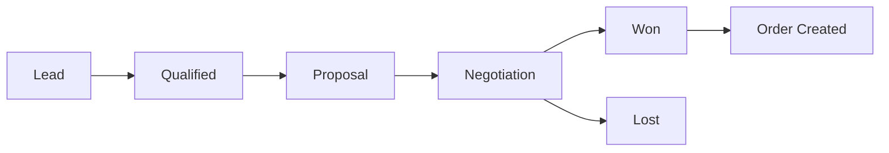
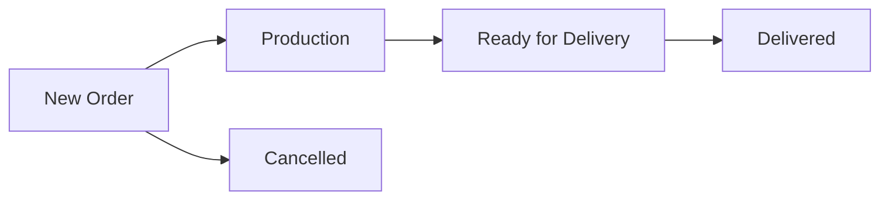
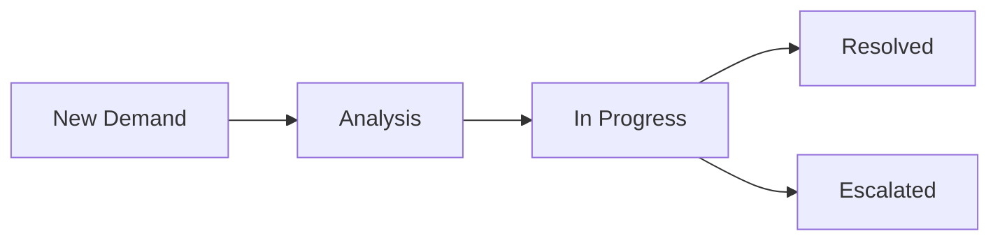

# CRM System Overview - Portal S4A

## Module Overview

The CRM (Customer Relationship Management) system is a core module of Portal S4A designed to manage the complete sales pipeline from lead generation to post-sales support.

## Core Components

### 1. Client Portfolio (`client_portfolio`)
**Purpose:** Central repository for all client information

**Key Features:**
- Company and individual client support
- Multiple contact management
- Financial information tracking
- Risk classification system
- Contract management

**Database Schema:**
```sql
CREATE TABLE client_portfolio (
  id SERIAL PRIMARY KEY,
  company_name TEXT NOT NULL,
  trading_name TEXT,
  cnpj TEXT,
  cpf TEXT,
  contact_name TEXT,
  contact_email TEXT,
  contact_phone TEXT,
  financial_contact_name TEXT,
  financial_contact_email TEXT,
  credit_limit DECIMAL(15, 2),
  risk_classification TEXT CHECK (risk_classification IN ('baixo', 'médio', 'alto', 'muito_alto')),
  status TEXT CHECK (status IN ('ativo', 'inativo', 'suspenso', 'prospect')),
  -- Additional fields...
);
```

### 2. CRM Statuses (`crm_statuses`)
**Purpose:** Define pipeline stages for opportunities, orders, and post-sales

**Key Features:**
- Multi-type support (opportunity, order, post_sales)
- Visual customization (colors, order)
- Automation triggers
- User visibility control

**Status Types:**
- **Opportunity:** Lead → Qualified → Proposal → Won/Lost
- **Order:** New → Production → Ready → Delivered/Cancelled
- **Post-Sales:** New Demand → Analysis → In Progress → Resolved

### 3. Opportunities (`crm_opportunities`)
**Purpose:** Sales funnel management

**Key Features:**
- Probability tracking
- Value estimation
- Expected close dates
- Status progression
- Notes and history

### 4. Orders (`crm_orders`)
**Purpose:** Order processing and fulfillment

**Key Features:**
- Product line items
- Total value calculation
- Status tracking
- Integration with inventory
- Billing automation

### 5. Post-Sales (`crm_post_sales`)
**Purpose:** Customer support and service requests

**Key Features:**
- Priority management
- Issue tracking
- Resolution documentation
- Order relationship
- SLA tracking

## Business Process Flow

### Sales Pipeline


### Order Fulfillment


### Post-Sales Support


## Key Features

### 1. Kanban Interface
- **Visual Pipeline:** Drag-and-drop status management
- **Multi-Select:** Bulk operations on multiple items
- **Filtering:** By user, date, value, etc.
- **Real-time Updates:** Live collaboration

### 2. Client Management
- **360° View:** Complete client history
- **Transaction Timeline:** All interactions in one place
- **Multiple CPFs:** Support for multiple tax IDs
- **Contact Management:** Multiple contacts per client

### 3. Product Integration
- **Product Catalog:** Centralized product management
- **Pricing:** Flexible pricing with discounts
- **Inventory:** Stock tracking and alerts
- **Categories:** Product organization

### 4. Automation Features
- **Status Triggers:** Automatic actions on status change
- **Order Creation:** Auto-create orders from opportunities
- **Billing Integration:** Automatic invoice generation
- **Notifications:** Real-time alerts and updates

### 5. Reporting & Analytics
- **Pipeline Reports:** Conversion rates, cycle times
- **Revenue Tracking:** Forecasting and actuals
- **Performance Metrics:** Individual and team performance
- **Custom Dashboards:** Configurable analytics

## Technical Architecture

### Database Design
- **Normalized Schema:** Efficient data organization
- **Foreign Keys:** Data integrity enforcement
- **Indexes:** Optimized query performance
- **Constraints:** Business rule enforcement

### API Layer
- **Server Actions:** Type-safe data operations
- **Validation:** Zod schema validation
- **Permissions:** Role-based access control
- **Error Handling:** Comprehensive error management

### Frontend Components
- **Reusable Components:** Consistent UI patterns
- **Form Management:** React Hook Form integration
- **State Management:** Optimistic updates
- **Real-time Updates:** WebSocket integration

## User Roles & Permissions

### Sales Representative
- **Opportunities:** Create, edit own opportunities
- **Clients:** View and edit assigned clients
- **Orders:** View related orders
- **Reports:** Personal performance metrics

### Sales Manager
- **Team Management:** View team performance
- **Pipeline Oversight:** Monitor all opportunities
- **Approval Workflows:** Approve discounts, special terms
- **Advanced Reports:** Team and regional analytics

### Administrator
- **System Configuration:** Manage statuses, products
- **User Management:** Assign permissions and territories
- **Data Management:** Import/export, bulk operations
- **System Reports:** Full system analytics

## Integration Points

### HR Module
- **User Management:** Employee-based assignments
- **Team Structure:** Hierarchical organization
- **Performance Tracking:** Sales metrics integration

### Inventory Module
- **Stock Management:** Real-time inventory updates
- **Product Information:** Centralized product data
- **Availability Checking:** Stock validation

### Billing Module
- **Invoice Generation:** Automatic billing triggers
- **Payment Tracking:** Integration with financial systems
- **Revenue Recognition:** Accounting integration

### Notification System
- **Real-time Alerts:** Status changes, assignments
- **Email Notifications:** External communication
- **Dashboard Updates:** Live data refresh

## Configuration Options

### Status Management
- **Custom Statuses:** Define business-specific stages
- **Color Coding:** Visual differentiation
- **Automation Rules:** Trigger-based actions
- **User Visibility:** Role-based status access

### Pipeline Configuration
- **Stage Requirements:** Mandatory fields per stage
- **Approval Workflows:** Multi-level approvals
- **Validation Rules:** Business logic enforcement
- **SLA Management:** Time-based escalations

### Reporting Setup
- **Custom Fields:** Additional data capture
- **Report Templates:** Predefined report formats
- **Dashboard Widgets:** Configurable analytics
- **Export Options:** Data export capabilities

## Performance Considerations

### Database Optimization
- **Proper Indexing:** Query performance optimization
- **Connection Pooling:** Efficient resource usage
- **Query Optimization:** Minimize database load
- **Caching Strategy:** Reduce redundant queries

### Frontend Performance
- **Lazy Loading:** On-demand component loading
- **Optimistic Updates:** Immediate UI feedback
- **Pagination:** Large dataset management
- **Debounced Search:** Efficient filtering

### Scalability
- **Horizontal Scaling:** Multi-instance deployment
- **Database Sharding:** Large dataset distribution
- **CDN Integration:** Static asset optimization
- **Caching Layers:** Multi-level caching strategy

## Security Measures

### Data Protection
- **Encryption:** Sensitive data encryption
- **Access Control:** Role-based permissions
- **Audit Logging:** Change tracking
- **Data Validation:** Input sanitization

### User Security
- **Authentication:** Secure login mechanisms
- **Session Management:** Secure session handling
- **Permission Validation:** Server-side checks
- **Rate Limiting:** API abuse prevention

## Future Enhancements

### Planned Features
- **AI Integration:** Predictive analytics, lead scoring
- **Mobile App:** Native mobile application
- **Advanced Automation:** Workflow automation
- **Third-party Integrations:** CRM, ERP, marketing tools

### Scalability Improvements
- **Microservices:** Service decomposition
- **Event-driven Architecture:** Asynchronous processing
- **Advanced Analytics:** Machine learning integration
- **Global Deployment:** Multi-region support