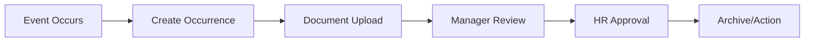

# HR Dashboard System - Portal S4A

## Module Overview

The HR (Human Resources) system provides comprehensive employee lifecycle management with real-time analytics, occurrence tracking, and organizational structure management.

## Core Components

### 1. Employee Management (`employees`)
**Purpose:** Central employee database with complete lifecycle tracking

**Key Features:**
- Complete employee profiles
- Document management
- Contract tracking
- Hierarchical organization
- Performance monitoring

**Database Schema:**
```sql
CREATE TABLE employees (
  id SERIAL PRIMARY KEY,
  -- Personal Information
  name TEXT NOT NULL,
  social_name TEXT,
  cpf TEXT UNIQUE NOT NULL,
  birth_date DATE,
  gender TEXT CHECK (gender IN ('masculino', 'feminino', 'outro')),
  
  -- Employment Information
  entry_date DATE NOT NULL,
  employee_role TEXT,
  employee_status TEXT CHECK (employee_status IN ('ativo_registrado', 'ativo_nao_registrado', 'férias', 'afastado', 'desligado')),
  salary DECIMAL(15, 2),
  
  -- Contract Information
  contract_type TEXT CHECK (contract_type IN ('30+30', '30+60', '45+45')),
  trial_end_part1 DATE,
  trial_end_part2 DATE,
  
  -- Contact Information
  email TEXT,
  phone TEXT,
  cell_phone TEXT,
  
  -- Address
  cep TEXT,
  street TEXT,
  city TEXT,
  state TEXT,
  
  -- Additional Data (JSONB)
  bank_accounts JSONB DEFAULT '[]'::jsonb,
  dependents JSONB DEFAULT '[]'::jsonb,
  work_hours JSONB DEFAULT '[]'::jsonb,
  
  created_at TIMESTAMPTZ DEFAULT NOW(),
  updated_at TIMESTAMPTZ DEFAULT NOW()
);
```

### 2. Occurrences (`occurrences`)
**Purpose:** Track employee events, incidents, and lifecycle changes

**Key Features:**
- Multiple occurrence types
- Date range support
- File attachments
- Status tracking
- Automated notifications

**Occurrence Types:**
- **Administrative:** Hiring, termination, salary adjustments
- **Disciplinary:** Warnings, suspensions
- **Benefits:** Vacation, medical leave, licenses
- **Performance:** Feedback, evaluations, ASO (occupational health)
- **Attendance:** Absences, tardiness

### 3. Job Positions (`job_positions`)
**Purpose:** Define organizational roles and hierarchies

**Key Features:**
- Role definitions
- Salary ranges
- Requirements tracking
- Department organization
- Career progression paths

### 4. Teams & Hierarchies
**Purpose:** Organizational structure management

**Key Features:**
- Team composition
- Reporting relationships
- Manager assignments
- Cross-functional teams
- Project-based organization

## Dashboard Analytics

### Key Metrics

#### Employee Statistics
- **Total Employees:** Active headcount
- **New Hires:** Monthly/quarterly additions
- **Turnover Rate:** Departure statistics
- **Department Distribution:** Headcount by area

#### Contract Management
- **Trial Periods:** Upcoming trial end dates
- **Contract Renewals:** Renewal tracking
- **Employment Types:** Distribution analysis
- **Salary Analytics:** Compensation insights

#### Occurrence Tracking
- **Recent Occurrences:** Latest events
- **Occurrence Types:** Category distribution
- **Pending Actions:** Items requiring attention
- **Compliance Tracking:** Regulatory requirements

#### Geographic Distribution
- **Employee Locations:** City/state distribution
- **Remote Workers:** Location flexibility tracking
- **Office Assignments:** Physical presence management

### Dashboard Widgets

#### Employee Overview Card
```typescript
interface EmployeeOverview {
  totalEmployees: number;
  activeEmployees: number;
  newHiresThisMonth: number;
  turnoverRate: number;
  averageTenure: number;
}
```

#### Contract Status Card
```typescript
interface ContractStatus {
  trialPeriods: {
    endingThisWeek: number;
    endingThisMonth: number;
    part1Ending: Employee[];
    part2Ending: Employee[];
  };
  contractRenewals: number;
  permanentEmployees: number;
}
```

#### Recent Activity Card
```typescript
interface RecentActivity {
  recentOccurrences: Occurrence[];
  pendingApprovals: number;
  upcomingDeadlines: Date[];
  systemAlerts: Alert[];
}
```

#### Geographic Distribution Chart
- **City Distribution:** Employee count by city
- **State Analysis:** Regional presence
- **Remote Work Statistics:** Location flexibility metrics

## Business Processes

### Employee Onboarding


### Occurrence Management


### Performance Review Cycle


## Key Features

### 1. Employee Lifecycle Management
- **Onboarding:** Structured new hire process
- **Development:** Career progression tracking
- **Performance:** Regular review cycles
- **Offboarding:** Structured departure process

### 2. Occurrence System
- **Event Tracking:** Comprehensive event logging
- **Document Management:** File attachment support
- **Workflow:** Approval and review processes
- **Notifications:** Automated alerts and reminders

### 3. Organizational Structure
- **Hierarchy Management:** Reporting relationships
- **Team Organization:** Cross-functional teams
- **Role Definitions:** Clear job descriptions
- **Succession Planning:** Leadership development

### 4. Compliance & Reporting
- **Regulatory Compliance:** Labor law adherence
- **Audit Trails:** Complete change history
- **Standard Reports:** Predefined analytics
- **Custom Reports:** Flexible reporting tools

### 5. Calendar Integration
- **Event Scheduling:** Important date tracking
- **Reminder System:** Automated notifications
- **Team Calendar:** Shared scheduling
- **Holiday Management:** Company calendar

## Technical Implementation

### Data Architecture
- **Normalized Design:** Efficient data organization
- **JSONB Fields:** Flexible data storage
- **Audit Logging:** Change tracking
- **Performance Optimization:** Strategic indexing

### Real-time Features
- **Live Dashboard:** Real-time metric updates
- **Notifications:** Instant alerts
- **Collaborative Editing:** Multi-user support
- **WebSocket Integration:** Live data sync

### Security & Privacy
- **Data Encryption:** Sensitive information protection
- **Access Control:** Role-based permissions
- **Audit Logging:** Complete activity tracking
- **GDPR Compliance:** Privacy regulation adherence

## User Roles & Permissions

### HR Administrator
- **Full Access:** Complete system management
- **Employee Management:** Create, edit, delete employees
- **System Configuration:** Settings and preferences
- **Report Generation:** All analytics and reports

### HR Manager
- **Department Access:** Assigned department management
- **Occurrence Management:** Review and approve events
- **Reporting:** Department-specific analytics
- **Employee Support:** Direct employee assistance

### Manager
- **Team Access:** Direct report management
- **Occurrence Creation:** Team event logging
- **Performance Reviews:** Team member evaluations
- **Basic Reporting:** Team-specific metrics

### Employee
- **Self-Service:** Personal information updates
- **Occurrence Viewing:** Personal event history
- **Document Access:** Personal document retrieval
- **Calendar Access:** Personal and team calendars

## Integration Points

### CRM Module
- **User Management:** Employee-based CRM assignments
- **Sales Performance:** Revenue attribution
- **Team Structure:** Sales hierarchy integration
- **Performance Metrics:** Cross-module analytics

### Authentication System
- **User Accounts:** Employee-based authentication
- **Permission Management:** Role-based access
- **Profile Integration:** Unified user profiles
- **Security Policies:** Consistent access control

### Notification System
- **Event Alerts:** Occurrence notifications
- **Deadline Reminders:** Important date alerts
- **System Updates:** Change notifications
- **Performance Alerts:** Metric-based notifications

## Performance Optimizations

### Database Performance
- **Strategic Indexing:** Query optimization
- **Connection Pooling:** Resource efficiency
- **Query Optimization:** Minimal database load
- **Caching Strategy:** Reduced redundant queries

### Dashboard Performance
- **Lazy Loading:** On-demand data loading
- **Pagination:** Large dataset management
- **Caching:** Client-side data caching
- **Optimistic Updates:** Immediate UI feedback

### Real-time Updates
- **WebSocket Optimization:** Efficient real-time sync
- **Selective Updates:** Targeted data refresh
- **Debounced Operations:** Reduced server load
- **Background Processing:** Async operations

## Analytics & Reporting

### Standard Reports
- **Headcount Reports:** Employee statistics
- **Turnover Analysis:** Departure trends
- **Compensation Reports:** Salary analytics
- **Compliance Reports:** Regulatory requirements

### Custom Analytics
- **Flexible Filtering:** Multi-dimensional analysis
- **Export Options:** Various format support
- **Scheduled Reports:** Automated delivery
- **Interactive Dashboards:** Real-time exploration

### Key Performance Indicators
- **Employee Satisfaction:** Survey-based metrics
- **Retention Rate:** Long-term employment tracking
- **Time to Hire:** Recruitment efficiency
- **Training Completion:** Development tracking

## Future Enhancements

### Planned Features
- **AI-Powered Analytics:** Predictive insights
- **Mobile Application:** Native mobile access
- **Advanced Workflows:** Automated processes
- **Integration Expansion:** Third-party connections

### Scalability Improvements
- **Microservices Architecture:** Service decomposition
- **Advanced Caching:** Multi-layer caching
- **Global Deployment:** Multi-region support
- **Performance Monitoring:** Advanced observability