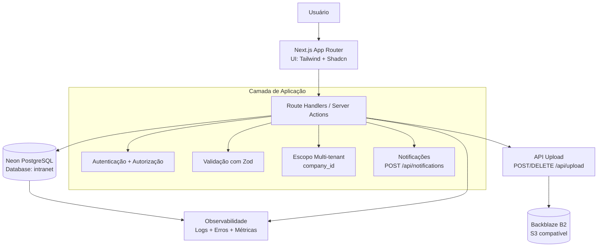

# SYSTEM_DESIGN

## 1. Objetivo

Descrever o desenho do sistema do **portal_s4a**, com foco em arquitetura, responsabilidades de camadas, fluxos críticos e requisitos não-funcionais.

## 2. Escopo

Este documento cobre:

- Frontend e backend no mesmo projeto Next.js (App Router)
- Persistência em PostgreSQL (Neon)
- Upload de arquivos em S3 compatível (Backblaze B2)
- Regras de autenticação, autorização e multi-tenant (`company_id`)
- Observabilidade e princípios operacionais de produção

## 3. Contexto da Solução

- **Framework principal:** Next.js + TypeScript estrito
- **UI:** Tailwind + Shadcn/UI
- **Validação de dados:** Zod
- **Banco de dados:** Neon PostgreSQL (database `intranet`)
- **Armazenamento de arquivos:** Backblaze B2 (via camada S3)
- **Notificações in-app:** endpoint `POST /api/notifications`

## 4. Arquitetura de Alto Nível

### 4.1 Camadas

1. **Camada de apresentação**
   - Rotas e componentes React (App Router)
   - Formulários com `react-hook-form` + `zod`

2. **Camada de aplicação**
   - Route Handlers e/ou Server Actions
   - Regras de negócio, autorização e orquestração

3. **Camada de dados**
   - Acesso ao PostgreSQL com queries parametrizadas
   - Operações sempre respeitando escopo organizacional

4. **Camada de integração**
   - Upload/download e remoção de arquivos via APIs de upload
   - Serviços transversais (notificações, monitoramento)

### 4.2 Princípios arquiteturais

- **Tenant-aware por padrão:** todas as operações com dados organizacionais devem filtrar por `company_id`
- **Fail-safe em segurança:** negar acesso por padrão quando permissões não forem comprovadas
- **Server-first para lógica crítica:** validação e autorização no servidor
- **Evolução orientada a migração:** mudanças de schema via migrações persistentes no Neon

### 4.3 Diagrama (Mermaid)

## 5. Fluxos Críticos

### 5.1 Autenticação e autorização

1. Usuário autenticado acessa recurso
2. Servidor valida sessão
3. Servidor valida papel/permissão para a ação
4. Operação é executada somente com escopo `company_id` válido

### 5.2 CRUD multi-tenant

1. Entrada validada por schema Zod
2. Query parametrizada executada no banco
3. Leitura/escrita restrita ao tenant
4. Retorno sanitizado ao cliente

### 5.3 Upload de arquivos

1. Cliente envia arquivo para `POST /api/upload`
2. Servidor valida tipo/tamanho/permissão
3. Arquivo é enviado ao bucket S3 compatível
4. URL persistida no banco (quando aplicável)
5. Remoção via `DELETE /api/upload?url=<fileUrl>`

## 6. Modelo de Dados (Diretrizes)

- Cada entidade de domínio organizacional deve ter estratégia clara de vinculação a `company_id`
- Índices devem existir para filtros recorrentes por tenant e data
- Operações de escrita relevantes devem considerar trilha de auditoria
- Nunca usar concatenação de SQL com input de usuário

## 7. Segurança

- Validação de entrada no servidor com Zod
- Privilégio mínimo para cargos/perfis
- Sigilo de credenciais em ambiente/deploy
- Proibição de logs com tokens/chaves ou dados sensíveis

## 8. Observabilidade e Operação

- Instrumentação de erros de backend e frontend (ex.: Sentry já configurado no projeto)
- Logs estruturados por contexto de request e tenant
- Monitorar: latência de API, erros 5xx, saturação de conexões DB, falhas em upload

## 9. Deploy e Runtime

- Deploy principal via `docker-stack.yaml` (Swarm/Portainer)
- Redes padrão: `internal`, `databases`, `tunnel`, `public`
- Configuração por variáveis de ambiente, sem segredos hardcoded

## 10. Decisões Arquiteturais Relevantes

- Monorepo de aplicação única Next.js para reduzir overhead operacional
- Server-side validation + permission checks para manter coerência de segurança
- Neon como banco gerenciado para elasticidade e operação simplificada
- Backblaze B2 para desacoplar arquivo de armazenamento local

## 11. Riscos Técnicos Conhecidos

- Crescimento de complexidade em route handlers sem camada de serviço bem definida
- Queries sem índices adequados por tenant podem gerar degradação significativa
- Dependência de integrações externas (DB/S3) exige fallback e observabilidade robustos

## 12. Próximos Passos Recomendados

- Evoluir este documento com diagramas C4 (Contexto, Contêiner, Componentes)
- Versionar decisões arquiteturais em ADRs na pasta `docs/architecture/`
- Definir SLIs/SLOs formais por domínio crítico (autenticação, upload, notificações)
